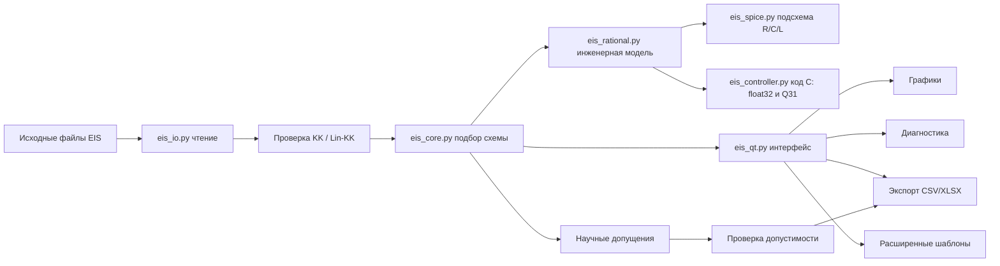

---
cssclasses:
  - eis-dashboard
tags:
  - dashboard
  - chem-suite
  - eis-solver
status: active
---

# EIS Solver

> [!summary] Лицо проекта
> **EIS Solver** — первый production-кирпич будущего **Chem Suite**: отдельная десктопная программа для анализа электрохимического импеданса, batch-фитинга эквивалентных схем, диагностики моделей и экспорта результатов.

> [!tip] Как пользоваться этим vault
> Начни с этой страницы. Для быстрого возвращения в код читай [[AI Handoff]]. Для понимания физики и математики читай блок **Научный слой** ниже. Для стратегии большого Chem Suite — [[10 Future Chem Suite]] и [[17 Chem Suite Philosophy]].

## Панель Навигации

| Раздел | Зачем читать |
|---|---|
| [[01 Product Overview]] | продуктовая рамка и назначение |
| [[02 User Workflow]] | пользовательские сценарии |
| [[03 Architecture]] | архитектура, модули, потоки данных |
| [[04 Scientific Model]] | текущая научная модель фитинга |
| [[05 Parser And Formats]] | парсеры и форматы файлов |
| [[06 GUI Features]] | GUI, вкладки, локализация, Help |
| [[07 Pro Mode And Presets]] | ручные схемы, bounds, presets |
| [[08 Export Contract]] | CSV/XLSX/report contract |
| [[09 Validation And Tests]] | smoke-тесты и будущий pytest |
| [[10 Future Chem Suite]] | дорожная карта большого suite |
| [[AI Handoff]] | короткий handoff для будущего AI-чата |

## Научный Слой

| Заметка | Что внутри |
|---|---|
| [[11 EIS Physical Cookbook]] | как читать формы Nyquist/Bode и выбирать физическую гипотезу |
| [[12 Fitting Math Notes]] | residuals, weighting, AIC/BIC, identifiability |
| [[13 Model Validity Checklist]] | чеклист перед тем как верить fit |
| [[14 Known Failure Modes]] | типовые ошибки данных, парсинга, физики и оптимизации |
| [[15 Parameter Meaning Library]] | смысл `R0`, `Rct`, `CPE_Q`, `alpha`, `W`, `L` |
| [[16 Decision Log]] | почему были приняты ключевые инженерные решения |
| [[17 Chem Suite Philosophy]] | принципы будущего Chem Suite |
| [[18 Теория - основы импедансной спектроскопии]] | базовая AC/complex impedance теория из методички |
| [[19 Nyquist и Bode - чтение спектров]] | как читать Nyquist и Bode вместе |
| [[20 Реальные системы - CPE, Warburg и неоднозначность схем]] | CPE, Warburg и неоднозначность equivalent circuits |
| [[21 Экспериментальная практика и артефакты]] | cell geometry, electrodes, roughness, artifacts |
| [[22 Transport Properties From EIS]] | conductivity/transport roadmap для будущего Chem Suite |
| [[23 Kramers-Kronig Validation]] | проверка физической согласованности спектра до доверия fit |
| [[24 Глоссарий]] | единый словарь терминов, сокращений и обозначений проекта |
| [[25 Пакетный конвейер и CLI]] | массовый headless-анализ, JSONL/CSV и коды завершения |
| [[26 Где лежит истина - статистический вывод и иерархический EIS]] | границы EIS, Байес, DRT, нейросети и анализ серий |
| [[34 SPICE и инженерные макромодели]] | научная ECM → пассивная рациональная модель → сеть Фостера R/C/L → SPICE |
| [[35 Экспорт C для контроллеров]] | дискретные состояния, `float32`, Q31, масштабы и ворота выдачи |
| [[36 Контур выпуска версии 1]] | состав версии 1, автоматическая приёмка, сборка и оставшиеся ворота |

## Карта Проекта

Открой Canvas:

```text
EIS Solver Map.canvas
```

В Obsidian он покажет интерактивную карту: продукт, код, научный слой, GUI, export, future suite.

## Главное Состояние



## Граница текущего выпуска

> [!success] Уже можно считать рабочим релизным контуром
> Для текстовых файлов и BioLogic `.mpt`: загрузка, batch, KK-check, auto-fit, Pro mode, manual bounds, plots, diagnostics, export, localization, help guide, Obsidian docs.

> [!success] Валидация `.mpr`
> Реальные лабораторные BioLogic EIS `.mpr` успешно прочитаны и fitted. Поддержка бинарного формата подтверждена на лабораторных данных; покрытие дополнительными приборами, каналами и multi-cycle файлами можно расширять дальше.

## Быстрый Запуск

```powershell
.\.venv\Scripts\python.exe eis_qt.py
```

CLI smoke:

```powershell
.\.venv\Scripts\python.exe eis_cli.py "double very good eis.txt" --no-plot
```

## Что Проверено

- `DEFAULT_CIRCUITS`: 17 схем, дублей нет.
- TXT smoke: best circuit `R0-p(R1,CPE0)-p(R2,CPE1)`.
- KK smoke на TXT через `impedance.validation.linKK`: `PASS`, RMSE около `0.689%`, max error около `3.003%`, `mu` около `0.804`, `M=14`.
- Mean fit error около `1.000%`.
- GUI worker, manual bounds, XLSX, drag-and-drop, Pro presets, localization smoke прошли.

## Рекомендуемая настройка Obsidian

> [!info] Core features
> Включи core plugin **Canvas**. Mermaid и callouts работают в Obsidian из коробки.

> [!info] Optional community plugins
> **Dataview** оживит таблицы на dashboard. **Templater** пригодится позже, если будем делать шаблоны decision logs, experiment notes и release notes.

## Источник теоретических заметок

> [!note] Методичка
> Источник: `Introductory impedance spectroscopy.pdf`. PDF является сканом с грязным OCR-слоем, поэтому заметки ниже — не перевод и не копия текста, а аккуратная русская инженерно-научная выжимка для проекта.

## Блоки Dataview

Если установлен Dataview, эти блоки станут живыми таблицами.

```dataview
TABLE status, tags
FROM "docs/EIS Solver Vault"
WHERE contains(tags, "science") OR contains(tags, "architecture") OR contains(tags, "workflow")
SORT file.name ASC
```

```dataview
LIST
FROM "docs/EIS Solver Vault"
WHERE status = "active"
SORT file.name ASC
```

## Для Будущего Меня

> [!quote] Главная мысль
> Код можно перечитать. Научные допущения, причины решений и критерии доверия модели надо записывать явно, иначе через полгода они исчезнут из головы.
