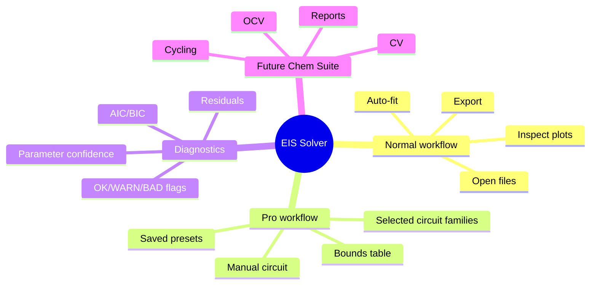

# Обзор продукта

EIS Solver — настольная программа для анализа данных электрохимической импедансной спектроскопии с помощью эквивалентных электрических схем.

Это не универсальная рисовалка графиков. Программа принимает исходные спектры, подбирает параметры нескольких осмысленных схем, показывает диагностику и готовит результаты для отчёта или дальнейшего анализа.

## Для кого предназначена программа

- Лабораторные электрохимики, которым нужен быстрый анализ серии файлов.
- Опытные пользователи, которые знают предполагаемую физическую схему и хотят задавать границы параметров вручную.
- Будущая экосистема Chem Suite, где EIS станет одним из модулей наряду с анализом циклирования, OCV, CV, GITT/PITT и подготовкой отчётов.

## Что получает пользователь

Обычный пользователь получает простой маршрут:

> Добавить файлы, запустить автоматический подбор, проверить графики и диагностику, экспортировать результаты.

Опытный пользователь получает полный контроль:

> Ввести свою эквивалентную схему, задать начальные значения и границы, сохранить настройку как локальный пресет и обработать всю серию файлов.

## Что уже входит в рабочий контур

- Графический интерфейс на PySide6.
- Переключение между русским и английским интерфейсом.
- Перетаскивание файлов и пакетная загрузка папки.
- Автоматический подбор по стандартному набору схем.
- Расширенный режим с выбранными семействами моделей.
- Ручной ввод схемы, начальных значений и границ.
- Локальные пользовательские пресеты.
- Просмотр метаданных и способа чтения файла.
- Диаграммы Найквиста и Боде, а также графики остатков.
- Экспорт CSV, XLSX, текстового отчёта и изображений.
- Единый `adaptive_v2` в GUI и командной строке.
- Проверенный пакет SPICE.
- Пакет C для контроллера в вариантах `float32` и Q31.
- Автоматическая приёмка кандидата выпуска.

## Что пока не входит в рабочий контур

- Расширенная проверка `.mpr` на дополнительных приборах, каналах и многоцикловых измерениях.
- Независимая проверка собранной программы на чистом компьютере.
- Пользовательская приёмка кандидата `0.9.0`.
- Общая облачная библиотека пресетов.
- Модули циклирования, CV и GITT.

## Устройство продукта

