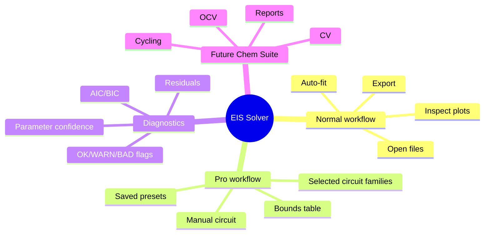

# Product Overview

EIS Solver is a focused desktop application for equivalent-circuit analysis of electrochemical impedance spectroscopy data.

It is intentionally not a generic plotting tool. Its job is to take raw impedance spectra, fit a reasonable set of circuit models, expose diagnostics, and produce outputs that can go into reports or further analysis.

## Target Users

- Lab electrochemists who need fast batch analysis.
- Advanced users who know the physical circuit and want manual bounds.
- Future Chem Suite workflows where EIS is one module among cycling, OCV, CV, GITT/PITT, and report tools.

## Product Promise

For a normal user:

> Drop files in, run auto-fit, inspect plots and diagnostics, export summary/results.

For an advanced user:

> Enter a custom equivalent circuit, set initial guesses and bounds, save the setup as a local preset, fit the batch.

## What Is In Production Scope

- PySide6 GUI.
- English/Russian UI switch.
- Drag-and-drop and folder batch loading.
- Auto-fit over the default circuit family.
- Pro mode with selected presets.
- Manual circuit fitting.
- Manual initial/lower/upper bounds.
- Local Pro presets.
- Parser metadata view.
- Nyquist, Bode, residual plots.
- CSV and XLSX export.
- Selected report and plot export.

## What Is Not Yet In Production Scope

- Real lab validation of BioLogic EIS `.mpr`.
- Formal pytest suite.
- Packaged executable smoke on a clean machine.
- Shared cloud/preset library.
- Cycling/CV/GITT modules.

## Product Shape

