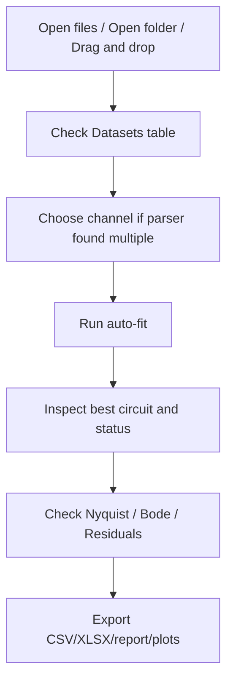
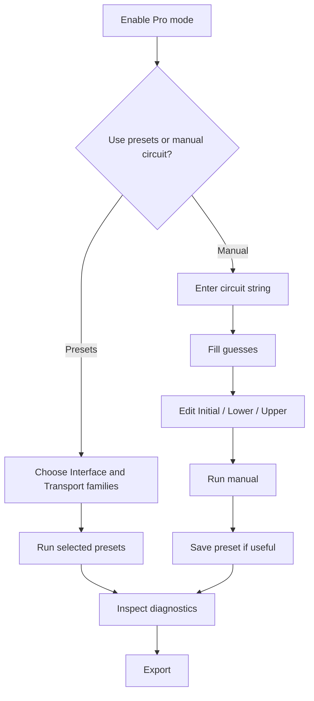

# User Workflow

This page describes how a human is expected to operate the app.

## Fast Workflow

Use this when the goal is a quick and reproducible first-pass fit.

## Pro Workflow

Use this when the automatic model family is too broad, or when the user knows the physical model.

## What To Look At After Fit

1. Best circuit
2. Fit percent
3. BIC/AIC
4. Status: `OK`, `WARN`, `BAD`
5. Flags
6. Residual plot
7. Whether parameters are physically plausible

## Normal Export Choice

For lab spreadsheets:

- `_summary.csv`
- `_workbook.xlsx`

For traceability:

- `_all_results.csv`
- `_best_parameters.csv`
- `_parser_metadata.csv`

For a selected sample report:

- `_report.txt`
- `_nyquist.png`
- `_bode.png`
- `_residuals.png`

## Language Switching

The app stays English by default. Russian UI is available through:

`View -> Language -> Русский`

Data exports, circuit strings, and column names intentionally stay stable.

