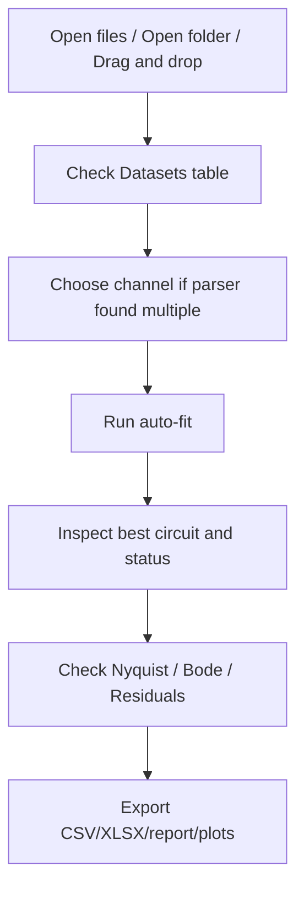
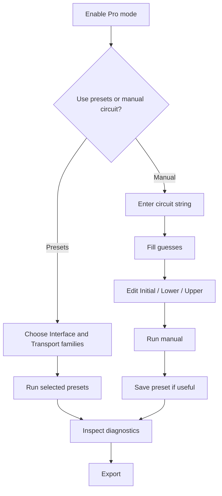

# Рабочие сценарии

Здесь описаны два основных способа работы: быстрый автоматический анализ и управляемый подбор модели в расширенном режиме.

## Быстрый сценарий

Этот сценарий подходит для быстрой и воспроизводимой первичной оценки спектра.

## Расширенный сценарий

Этот сценарий нужен, если стандартный набор моделей слишком широк или физическая схема системы уже известна.

## Что проверить после фитинга

1. Какая схема рекомендована.
2. Какова средняя ошибка фитинга.
3. Как соотносятся BIC и AIC у конкурирующих моделей.
4. Какое состояние присвоено результату: `OK`, `WARN` или `BAD`.
5. Какие диагностические флаги выставлены.
6. Есть ли структура на графике остатков.
7. Правдоподобны ли параметры с точки зрения физики системы.

## Обычный набор для экспорта

Для обычной лабораторной таблицы:

- `_summary.csv`
- `_workbook.xlsx`

Для воспроизводимости и разбора результата:

- `_all_results.csv`
- `_best_parameters.csv`
- `_parser_metadata.csv`

Для отдельного отчёта по выбранному образцу:

- `_report.txt`
- `_nyquist.png`
- `_bode.png`
- `_residuals.png`

## Переключение языка

По умолчанию интерфейс открывается на английском. Русский язык включается через меню:

`View -> Language -> Русский`

Имена колонок в экспорте и строки эквивалентных схем намеренно не переводятся: это стабильный машинно-читаемый контракт.
