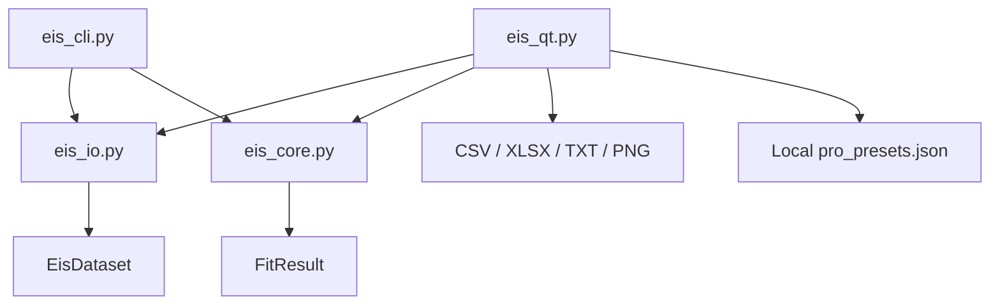
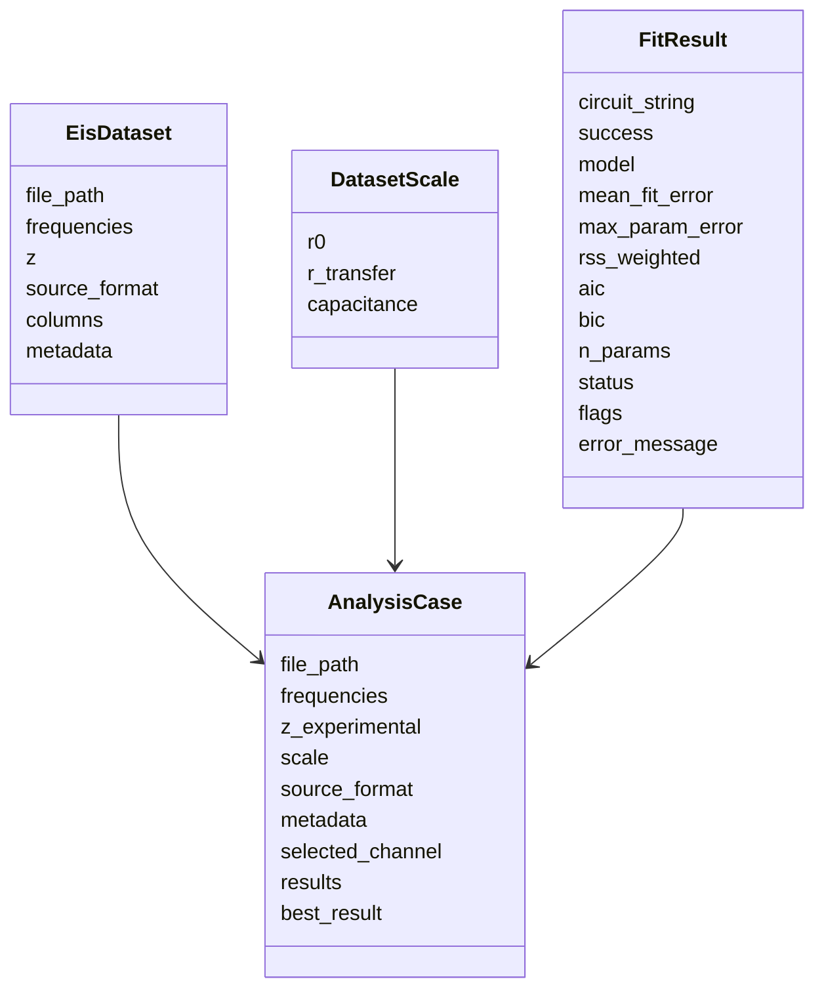
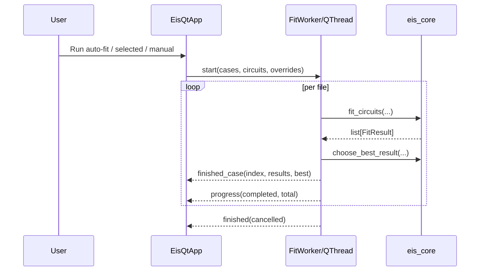

# Architecture

The architecture is deliberately simple: GUI, parser, fitting core, export.

## Module Map



## File Responsibilities

| File | Role |
|---|---|
| `eis_core.py` | Circuit families, guesses, bounds, fitting, AIC/BIC, flags |
| `eis_io.py` | Text/BioLogic parsing, channel detection, dataset cleaning |
| `eis_qt.py` | Production desktop GUI, threading, plots, export, localization |
| `eis_cli.py` | CLI smoke/debug entrypoint |
| `eis_utils.py` | Legacy compatibility wrapper |
| `eis_app.py` | Legacy launcher wrapper to `eis_qt.py` |
| `cycling.py` | Legacy scrap, not part of current EIS architecture |

## Core Data Types



## GUI Threading

Fitting is performed in a Qt worker thread so the GUI remains responsive during batch analysis.



## Local User Data

Pro presets are not stored in the repository.

Primary path on Windows:

```text
%APPDATA%\EIS Solver\pro_presets.json
```

Fallback path:

```text
.eis_solver_user/pro_presets.json
```

The fallback folder is ignored by git.

