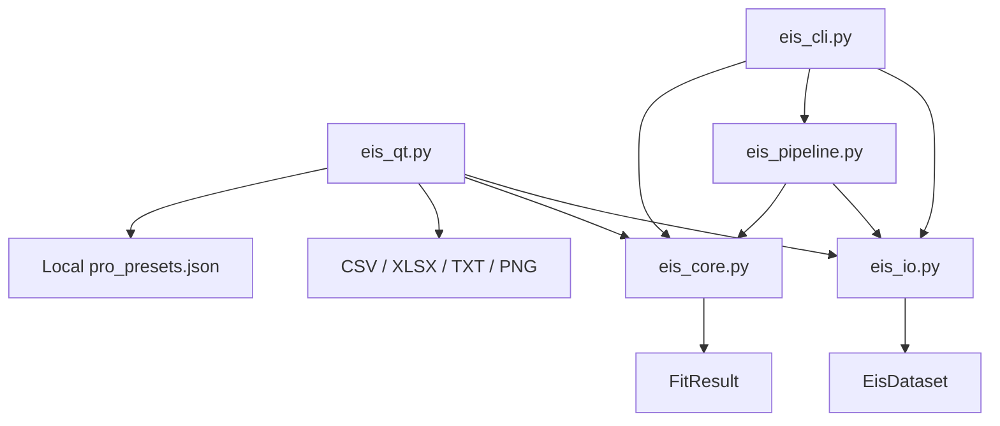
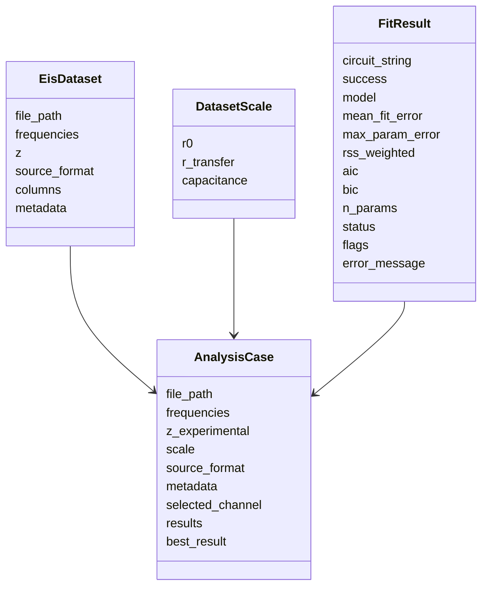
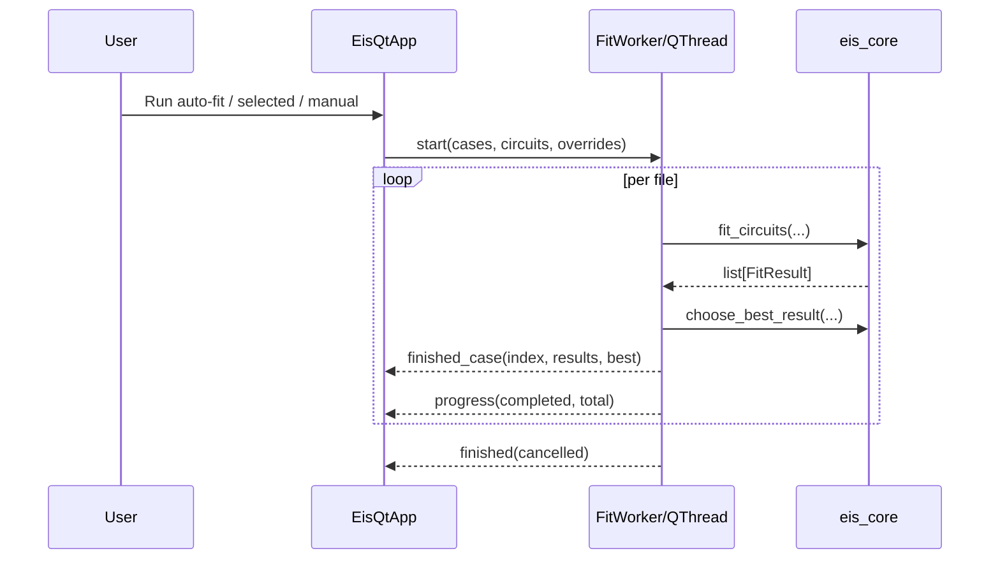

# Архитектура

Архитектура намеренно разделена на четыре понятные части: чтение данных, вычислительное ядро, пользовательские интерфейсы и экспорт.

## Карта модулей



## Ответственность файлов

| Файл | Ответственность |
|---|---|
| `eis_core.py` | Семейства схем, начальные значения, границы, фитинг, AIC/BIC и диагностические флаги |
| `eis_io.py` | Чтение текстовых файлов и BioLogic, поиск каналов, очистка набора данных |
| `eis_qt.py` | Основной настольный интерфейс, фоновая обработка, графики, экспорт и локализация |
| `eis_cli.py` | Интерфейс командной строки для воспроизводимых запусков и диагностики |
| `eis_pipeline.py` | Независимый конвейер анализа, пакетная обработка и сериализуемый `AnalysisResult` |
| `eis_utils.py` | Слой совместимости со старыми импортами |
| `eis_app.py` | Устаревшая точка запуска, перенаправляющая в `eis_qt.py` |
| `cycling.py` | Старый экспериментальный файл, не относящийся к действующей архитектуре EIS |

## Основные типы данных



## Фоновая работа GUI

Фитинг выполняется в рабочем потоке Qt. Поэтому окно продолжает отвечать во время обработки серии файлов, а пользователь видит ход выполнения и может запросить отмену.



## Локальные данные пользователя

Пользовательские пресеты расширенного режима не хранятся в репозитории.

Основной путь в Windows:

```text
%APPDATA%\EIS Solver\pro_presets.json
```

Запасной путь:

```text
.eis_solver_user/pro_presets.json
```

Запасная папка исключена из Git.
