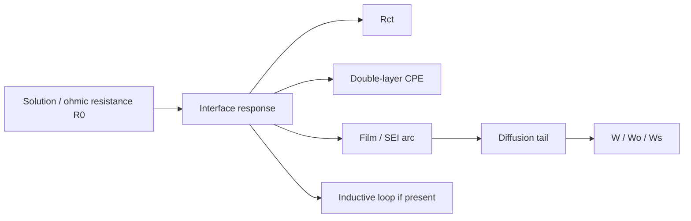
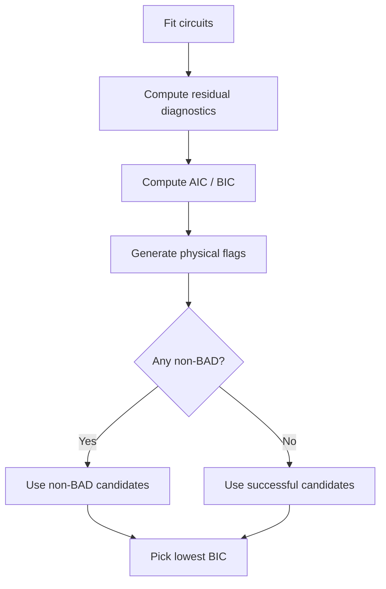

# Научная модель

This page documents the current electrochemical and mathematical assumptions.

## Движок фитинга

The fitting engine is `impedance.models.circuits.CustomCircuit`.

Current fit call:

```python
CustomCircuit.fit(..., weight_by_modulus=True)
```

This weights residuals by impedance modulus, which helps prevent high-impedance low-frequency points from dominating everything.

## Стандартные семейства схем

| Family | Purpose |
|---|---|
| `IDEAL_RC_CIRCUITS` | sanity-check ideal RC |
| `INTERFACE_CIRCUITS` | charge transfer, CPE, two arcs |
| `DIFFUSION_CIRCUITS` | Warburg and finite diffusion |
| `INDUCTIVE_CIRCUITS` | inductive loops or wiring/fixture effects |
| `DEFAULT_CIRCUITS` | full auto-fit list |

## Электрохимическая интерпретация



## Зачем нужен CPE

Ideal capacitors are rarely enough for porous, rough, aged, coated, or chemically heterogeneous electrodes.

The app keeps ideal `C` as a sanity-check model, but most practical circuit families use `CPE`.

## Выбор модели

The app does not choose the best model only by raw fit error.

Before model trust, the app also runs the `impedance.validation.linKK` Kramers-Kronig/Lin-KK consistency check on the loaded spectrum. This is a data-quality gate, not a circuit-selection score. Details live in [[23 Kramers-Kronig Validation]].

Current selection:

1. Fit all selected circuits.
2. Classify each result as `OK`, `WARN`, or `BAD`.
3. Исключить `BAD`, если остались другие кандидаты.
4. Найти минимальный BIC и сформировать окно статистической поддержки `ΔBIC ≤ 2`.
5. Внутри окна предпочесть более простую модель, затем `OK` перед `WARN`.

Статус не может отменить решающее преимущество по BIC: синтетические тесты показали, что истинный CPE иногда получает `WARN`, а приближённый идеальный RC — `OK`. Поэтому жёсткая иерархия статусов математически небезопасна.



## Проверка Крамерса—Кронига

Current implementation:

- wrapper function: `lin_kk_check()` in `eis_core.py`;
- library method: `impedance.validation.linKK`;
- result object: `KramersKronigResult`;
- GUI: dataset `KK` column plus `KK Check` tab;
- CLI: `=== Kramers-Kronig check ===`;
- export: summary `kk_*` columns, `_kk_check.csv`, XLSX `KK Check` sheet, `_kk_check.png`.

The Lin-KK check reconstructs the spectrum with a fixed distribution of RC relaxation times and reports:

- reconstruction RMSE;
- maximum relative error;
- Schönleber `mu` criterion;
- `PASS`, `WARN`, or `FAIL` status.

## Состояние результата

| Status | Meaning |
|---|---|
| `OK` | no current warning flags |
| `WARN` | useful candidate, but inspect flags/residuals |
| `BAD` | severe non-identifiability, bound issue, or impossible uncertainty |

## Текущие ограничения

- Kramers-Kronig validation uses the practical `impedance.py` Lin-KK implementation, not a full formal integral transform.
- No formal physical model priors beyond bounds and flags.
- No automatic rejection of all over-parameterized models beyond BIC/flags.
- BioLogic `.mpr` loading and fitting are validated on real laboratory EIS files; coverage can still be expanded across additional instruments, channels, and multi-cycle files.
- Each circuit fit has a 5,000-function-evaluation production budget and practical `1e-9` optimizer tolerances.
