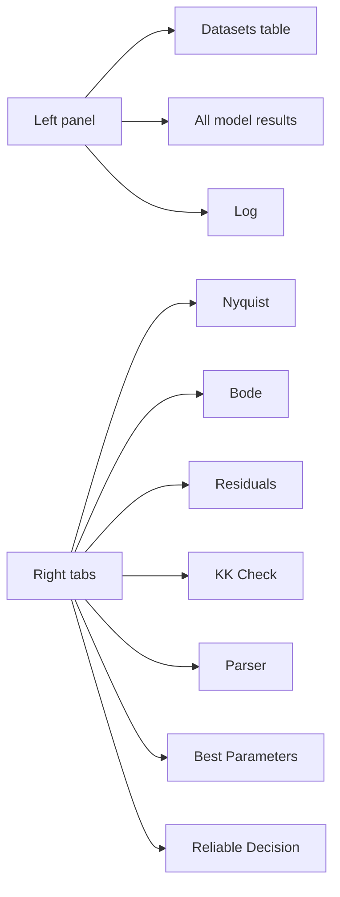

# Возможности интерфейса

The active GUI is `eis_qt.py`, based on PySide6.

## Главное окно

The GUI has:

- file/folder open actions;
- drag-and-drop;
- batch dataset table;
- results table;
- log panel;
- Nyquist, Bode, Residuals, KK Check tabs;
- Parser tab;
- Best Parameters tab;
- Pro mode;
- English/Russian language switch;
- Help/About guide.
- imported reliable-inference decision tab;
- draggable splitters for resizing controls, tables, log, plots, and Parser details.

## Компоновка интерфейса



## Надёжная рекомендация

`File -> Import reliable result...` загружает полный JSON от
`eis_inference.py` и связывает его с уже открытым EIS-файлом. GUI не повторяет
bootstrap, BIC-gate или Lin-KK decision logic.

Вкладка `Reliable Decision` показывает семейную рекомендацию, честное
`indistinguishable` вместо неподтверждённой `W/Wo/Ws`, причину отказа,
следующее действие и calibrated-gate details. При смене канала решение
сбрасывается. [Smoke-отчёт](../../../validation_data/reports/2026-07-17-gui-reliable-decision.md).

## Меню

| Menu | Purpose |
|---|---|
| File | open files/folder, export |
| Fit | run auto/selected/manual, cancel |
| View | language switching |
| Help | About / Guide |

## Перевод интерфейса

UI language is switched at runtime:

```text
View -> Language -> English / Русский
```

Data contracts remain language-stable:

- circuit strings stay English/impedance.py format;
- CSV/XLSX column names stay stable;
- sheet names stay stable.

## Справка и руководство

`Help -> About / Guide` opens a built-in guide covering:

- quick workflow;
- Pro mode;
- manual circuit syntax;
- diagnostics;
- file formats.

## Работа без зависаний

Fitting happens in `FitWorker` on a `QThread`.

Progress and log output update after every circuit. Cancel is cooperative and takes effect after the current circuit finishes.

Every nonlinear circuit fit has a finite 5,000-evaluation optimizer budget, so a non-identifiable model cannot use the upstream 100,000-evaluation default.

## Изменяемые панели

The main divider between controls/tables and plot tabs is draggable. Inside the left side, Datasets, dataset table, model-results table, and Log have independent vertical splitter handles. The Parser tab also has a draggable divider between detected columns and metadata.
