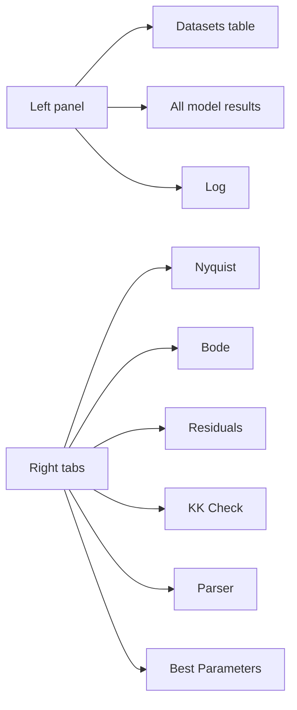

# GUI Features

The active GUI is `eis_qt.py`, based on PySide6.

## Main Surface

The GUI has:

- file/folder open actions;
- drag-and-drop;
- batch dataset table;
- results table;
- log panel;
- Nyquist, Bode, Residuals, KK Check tabs;
- Parser tab;
- Best Parameters tab;
- Pro mode;
- English/Russian language switch;
- Help/About guide.

## GUI Layout



## Menus

| Menu | Purpose |
|---|---|
| File | open files/folder, export |
| Fit | run auto/selected/manual, cancel |
| View | language switching |
| Help | About / Guide |

## Localization

UI language is switched at runtime:

```text
View -> Language -> English / Русский
```

Data contracts remain language-stable:

- circuit strings stay English/impedance.py format;
- CSV/XLSX column names stay stable;
- sheet names stay stable.

## About / Guide

`Help -> About / Guide` opens a built-in guide covering:

- quick workflow;
- Pro mode;
- manual circuit syntax;
- diagnostics;
- file formats.

## Responsiveness

Fitting happens in `FitWorker` on a `QThread`.

Cancel is cooperative: it takes effect after the current file/fit step finishes.
