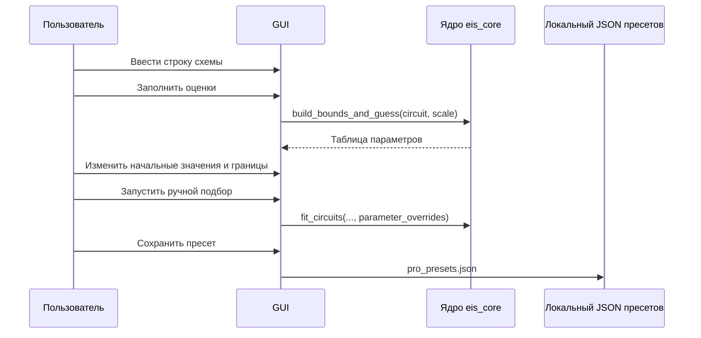

# Расширенный режим и пресеты

Расширенный режим предназначен для пользователей, которые понимают, какую
физическую модель хотят проверить.

По умолчанию он скрыт: обычный сценарий ограничивается загрузкой данных и
автоматическим подбором.

## Возможности расширенного режима

- наборы схем границы раздела;
- наборы транспортных и индуктивных схем;
- запуск только выбранных наборов;
- ручной ввод строки схемы;
- кнопка `?` со справкой по синтаксису;
- таблица начальных значений, нижних и верхних границ;
- локальное сохранение, загрузка и удаление пресетов;
- специализированный экспорт проверенного пакета SPICE;
- экспорт проверенного пакета C для контроллера в вариантах `float32` и Q31.

## Экспорт SPICE

Действие `Пакет SPICE...` находится в конце основной панели инструментов.
Оно:

- полностью скрыто вне расширенного режима;
- не дублируется в главном меню или обычной панели экспорта;
- становится доступным только после подбора модели для выбранного спектра;
- просит указать новый каталог пакета и исполняемый файл ngspice;
- использует тот же безопасный экспортёр, что и командная строка;
- при отказе не создаёт частичный пакет.

Это намеренно специализированный инструмент. Обычному пользователю SPICE не
показывается.

## Экспорт C для контроллера

Действие `Пакет C для контроллера...` находится там же, рядом со SPICE. Оно:

- полностью скрыто вне расширенного режима;
- просит новый каталог, период расчёта и полный масштаб тока;
- одним пакетом выдаёт физический вариант `float32` и нормированный Q31;
- добавляет паспорт модели и эталонные временные векторы;
- отказывает при недопустимой научной модели, полосе, ошибке дискретизации
  или непредставимых коэффициентах.

Подробный численный договор: [[35 Экспорт C для контроллеров]].

## Синтаксис ручной схемы

Примеры:

```text
R0-p(R1,CPE0)
R0-p(R1,CPE0)-p(R2,CPE1)
R0-p(R1,CPE0)-W0
L0-R0-p(R1,CPE0)
```

Правила:

- `-` означает последовательное соединение;
- `p(...,...)` означает параллельное соединение;
- поддерживаются элементы `R`, `C`, `CPE`, `W`, `Wo`, `Ws`, `L`;
- индексы значимы: `R0`, `R1`, `CPE0`, `CPE1`.

## Настройка начальных значений и границ



## Хранение пресетов

Основной путь в Windows:

```text
%APPDATA%\EIS Solver\pro_presets.json
```

Запасной путь:

```text
.eis_solver_user/pro_presets.json
```

Перед выбором каталога программа проверяет фактический доступ на запись.

## Почему пресеты хранятся локально

Локальные пресеты не смешивают личные лабораторные привычки с Git и общими
сборками программы.

Если обмен пресетами станет важен, нужно добавить явный импорт и экспорт их
JSON-файлов.
