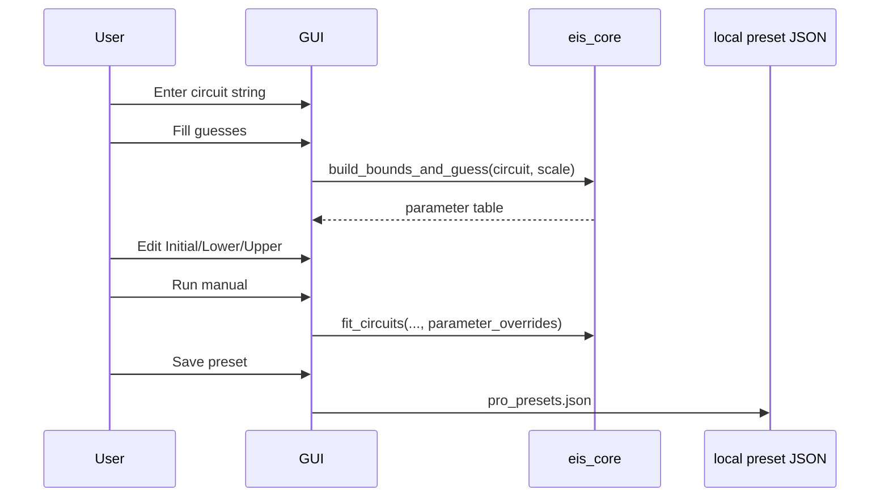

# Расширенный режим и пресеты

Pro mode is for users who know what physical model they want.

It is hidden by default so normal users can just load data and run auto-fit.

## Возможности расширенного режима

- Interface preset menu.
- Transport preset menu.
- Run selected presets.
- Manual circuit string input.
- `?` syntax help button.
- Initial/Lower/Upper parameter table.
- Local preset save/load/delete.

## Синтаксис ручной схемы

Examples:

```text
R0-p(R1,CPE0)
R0-p(R1,CPE0)-p(R2,CPE1)
R0-p(R1,CPE0)-W0
L0-R0-p(R1,CPE0)
```

Rules:

- `-` means series connection.
- `p(...,...)` means parallel connection.
- Supported elements: `R`, `C`, `CPE`, `W`, `Wo`, `Ws`, `L`.
- Index suffixes matter: `R0`, `R1`, `CPE0`, `CPE1`.

## Настройка начальных значений и границ



## Хранение пресетов

Primary Windows path:

```text
%APPDATA%\EIS Solver\pro_presets.json
```

Fallback:

```text
.eis_solver_user/pro_presets.json
```

The app checks real write access before choosing the config directory.

## Почему пресеты хранятся локально

Local presets keep user-specific lab habits off git and out of shared releases.

If preset sharing becomes important later, add explicit import/export for preset JSON files.
