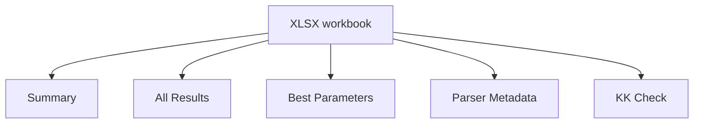

# Контракт экспорта

Export is available through:

```text
File -> Export...
```

The user chooses a base name, and the app writes one or more outputs.

## Выходные файлы

| Output | Purpose |
|---|---|
| `_summary.csv` | one row per loaded case |
| `_all_results.csv` | every circuit attempt for every case |
| `_best_parameters.csv` | best-fit parameters and confidence values |
| `_parser_metadata.csv` | parser metadata and detected columns |
| `_kk_check.csv` | Kramers-Kronig/Lin-KK data-validity summary |
| `_workbook.xlsx` | Excel workbook with five sheets |
| `_report.txt` | selected-case text report |
| `_nyquist.png` | selected-case Nyquist plot |
| `_bode.png` | selected-case Bode plot |
| `_residuals.png` | selected-case residual plot |
| `_kk_check.png` | selected-case KK reconstruction/error plot |

## Листы книги Excel



## Стабильный состав данных

CSV/XLSX column names stay English and stable even when the GUI language is Russian.

This is intentional:

- scripts can consume exports safely;
- spreadsheet templates do not break;
- future Chem Suite modules can rely on stable keys.

## Состав сводной таблицы

One row per loaded file:

- file path and name;
- source format;
- selected channel;
- number of points;
- KK status and KK metrics;
- scale guesses;
- best circuit;
- fit error;
- AIC/BIC;
- status and flags.

## Состав таблицы всех результатов

One row per attempted circuit:

- circuit string;
- success/fail;
- status;
- fit error;
- AIC/BIC;
- parameter error;
- flags or error message.

## Состав таблицы лучших параметров

One row per best-fit parameter:

- parameter name;
- value;
- confidence;
- relative error percent.

## Состав таблицы проверки Крамерса—Кронига

One row per loaded file:

- status;
- success flag;
- RMSE percent;
- max error percent;
- Lin-KK `mu`;
- number of RC terms;
- flags;
- error message.
