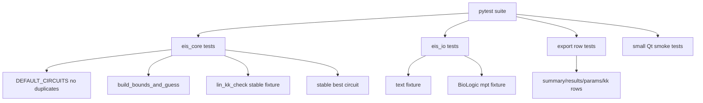

# Validation And Tests

This page records what has been validated so far and what should become formal tests.

## Smoke Tests Already Run

- Python compile for core modules.
- CLI on `double very good eis.txt`.
- Circuit list duplicate check.
- Generic text parser.
- BioLogic `.mpt` parser using public galvani sample.
- Non-EIS `.mpr` correctly rejected for missing EIS columns.
- GUI offscreen creation.
- GUI worker auto-fit on txt and `.mpt`.
- Manual circuit fit.
- Manual bounds override.
- Folder loader.
- Drag/drop path collection.
- CSV export builders.
- XLSX workbook export.
- Pro preset save/load fallback.
- English/Russian UI switching.
- About/Guide dialog creation.
- Kramers-Kronig/Lin-KK core smoke.
- GUI offscreen load confirmed dataset `KK` column and `kk_check_rows()`.
- PyInstaller folder build completed with `eis_app.spec`.
- Packaged exe launch smoke: `dist\eis_qt\eis_qt.exe` started and stayed alive for 8 seconds.
- Real single-sweep BioLogic `.mpr` with 61 unique frequencies loaded and fitted successfully.
- Full 17-circuit MPR CLI run completed in about 4.8 seconds in the macOS diagnostic environment after adding the optimizer budget.

## Known Best Test Result

Test file:

```text
double very good eis.txt
```

Best circuit:

```text
R0-p(R1,CPE0)-p(R2,CPE1)
```

Mean fit error:

```text
about 1.000%
```

Max parameter error:

```text
about 12.18%
```

KK smoke through `impedance.validation.linKK`:

```text
PASS; RMSE about 0.689%; max error about 3.003%; mu about 0.804; M=14
```

## Suggested Future Pytest Suite



## Release Gate Before Sharing EXE

Before giving the app to other users:

1. Run CLI smoke.
2. Run GUI smoke.
3. Test export folder permissions.
4. Test clean-machine startup.
5. Validate additional multi-cycle and multi-channel BioLogic EIS `.mpr` files.
6. Build PyInstaller executable.
7. Confirm `PySide6`, `matplotlib`, `galvani`, `openpyxl`, `impedance` are included.

Current local build:

```text
dist\eis_qt\eis_qt.exe
```

Still not checked: clean-machine startup outside the development environment.
