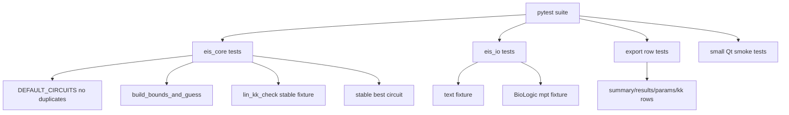

# Проверка и тестирование

This page records what has been validated so far and what should become formal tests.

## Уже выполненные дымовые тесты

- Python compile for core modules.
- CLI on `double very good eis.txt`.
- Circuit list duplicate check.
- Generic text parser.
- BioLogic `.mpt` parser using public galvani sample.
- Non-EIS `.mpr` correctly rejected for missing EIS columns.
- GUI offscreen creation.
- GUI worker auto-fit on txt and `.mpt`.
- Manual circuit fit.
- Manual bounds override.
- Folder loader.
- Drag/drop path collection.
- CSV export builders.
- XLSX workbook export.
- Pro preset save/load fallback.
- English/Russian UI switching.
- About/Guide dialog creation.
- Kramers-Kronig/Lin-KK core smoke.
- GUI offscreen load confirmed dataset `KK` column and `kk_check_rows()`.
- PyInstaller folder build completed with `eis_app.spec`.
- Packaged exe launch smoke: `dist\eis_qt\eis_qt.exe` started and stayed alive for 8 seconds.
- Real laboratory BioLogic EIS `.mpr` files loaded and fitted successfully (including a single-sweep file with 61 unique frequencies).
- Headless pipeline tests cover JSON-safe parameter serialization, recursive input discovery, continuation after a bad file, fail-fast persistence, and CSV summaries.
- CLI JSON smoke passed on the BioLogic `EIS_latin1.mpt` sample.
- Full 17-circuit MPR CLI run completed in about 4.8 seconds in the macOS diagnostic environment after adding the optimizer budget.

## Известный лучший результат на тестовых данных

## Открытые экспериментальные данные

Базовый прогон от 2026-07-17 использует два открытых корпуса Zenodo под CC BY 4.0: 54 однотипные NMC811-ячейки 21700 и 72 спектра катода LG MJ1 по SOC.

- прочитаны `126/126` файлов;
- Lin-KK: `84 PASS`, `36 WARN`, `6 FAIL`;
- выполнено 504 фитинга простого семейства и 204 фитинга полного набора на стратифицированной выборке;
- технических сбоев и исчерпания бюджета не было;
- обнаружен риск ранжирования `OK/WARN` по одному BIC;
- подробности: [отчёт базовой проверки](../../../validation_data/reports/2026-07-17-open-datasets-baseline.md).

## Синтетическая истина

Генератор `eis_synthetic.py` создаёт CSV со схемой и параметрами, известными заранее. Первая калибровка селектора на 30 спектрах с шумом 1% дала `22/30` точных топологий при политике `ΔBIC ≤ 2`.

- идеальный RC: `10/10`;
- одно CPE-звено: `10/10`;
- две CPE-дуги: `2/10`.

Жёсткое правило `OK > WARN` отвергнуто экспериментально. Низкая точность двух дуг указывает на необходимость multi-start оптимизации, а не очередного косметического штрафа селектора. Подробности: [отчёт синтетической проверки](../../../validation_data/reports/2026-07-17-synthetic-selector-baseline.md).

## Multi-start

Детерминированный режим с четырьмя стартами проверен на тех же десяти двухдуговых спектрах. Не первый старт победил в `5/10` файлов; в четырёх случаях RSS истинной модели улучшился радикально. Однако итоговая точность топологии осталась `2/10`, потому что параметры продолжили быть неидентифицируемыми и истинная модель часто сохраняла `BAD`.

Вывод: multi-start лечит локальные минимумы, но не недостаток информации. Режим доступен через `--restarts` и `--restart-seed`, пока остаётся выключенным по умолчанию. Подробности: [отчёт multi-start](../../../validation_data/reports/2026-07-17-multistart-benchmark.md).

Test file:

```text
double very good eis.txt
```

Best circuit:

```text
R0-p(R1,CPE0)-p(R2,CPE1)
```

Mean fit error:

```text
about 1.000%
```

Max parameter error:

```text
about 12.18%
```

KK smoke through `impedance.validation.linKK`:

```text
PASS; RMSE about 0.689%; max error about 3.003%; mu about 0.804; M=14
```

## Предлагаемый набор автоматических тестов



## Проверки перед распространением программы

Before giving the app to other users:

1. Run CLI smoke.
2. Run GUI smoke.
3. Test export folder permissions.
4. Test clean-machine startup.
5. Validate additional multi-cycle and multi-channel BioLogic EIS `.mpr` files.
6. Build PyInstaller executable.
7. Confirm `PySide6`, `matplotlib`, `galvani`, `openpyxl`, `impedance` are included.

Current local build:

```text
dist\eis_qt\eis_qt.exe
```

Still not checked: clean-machine startup outside the development environment.
