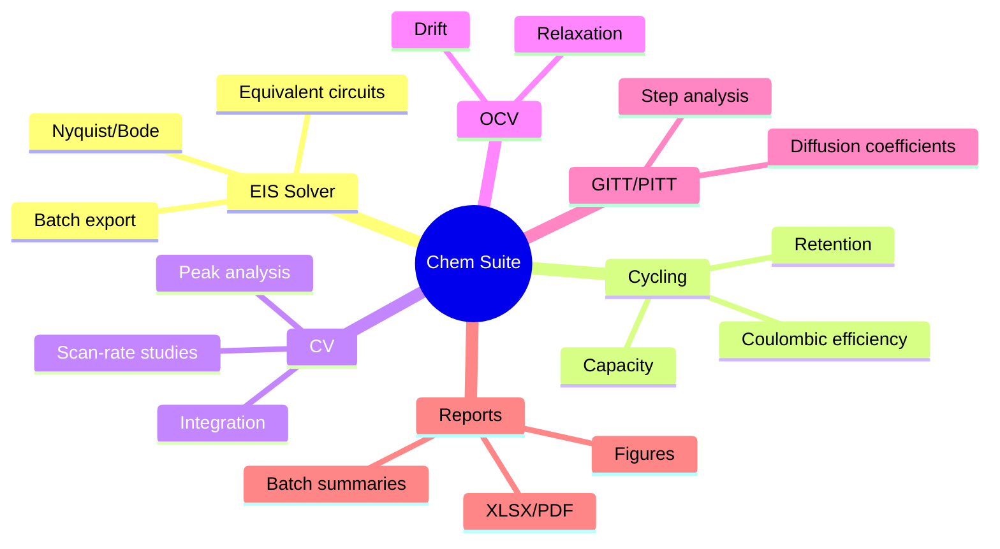
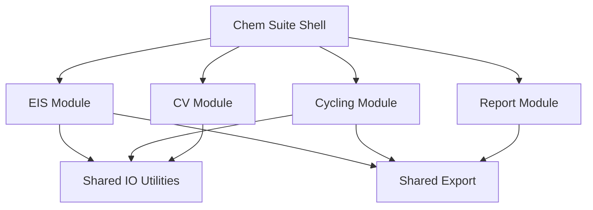

# Future Chem Suite

EIS Solver is the first brick of a broader Chem Suite.

The key design principle: keep each scientific workflow as a strong standalone module, but share infrastructure where it makes sense.

## Possible Suite Modules

## What To Reuse

From EIS Solver:

- PySide6 app shell.
- Drag/drop and folder loading patterns.
- Export dialog pattern.
- English/Russian localization approach.
- Local user preset storage.
- Worker-thread pattern.
- README plus Obsidian vault documentation style.

## What To Avoid

- Do not revive `cycling.py` directly as production code.
- Do not put domain logic directly in GUI.
- Do not make export columns depend on UI language.
- Do not make shared modules before two modules truly need the same abstraction.

## Suggested Long-Term Architecture

## EIS Module Boundary

EIS Solver should remain independently runnable even if Chem Suite becomes a larger app.

That means:

- `eis_core.py` stays GUI-independent;
- `eis_io.py` stays testable;
- `eis_qt.py` can either stay standalone or become embedded later;
- exports remain usable outside the suite.

