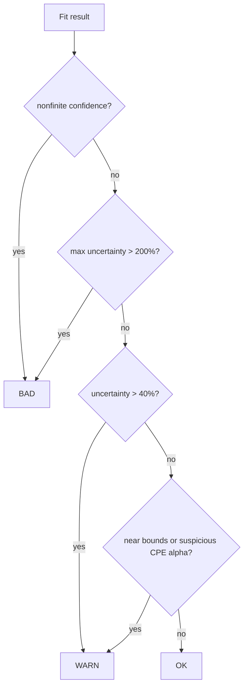

---
tags:
  - science
  - math
  - fitting
status: active
---

# Математика фитинга

Эта заметка фиксирует математическую логику текущего фитинга и почему мы не доверяем просто минимальной ошибке.

## Что минимизирует оптимизатор

`impedance.py` делает nonlinear least squares для комплексного импеданса.

В текущем коде используется:

```python
weight_by_modulus=True
```

Это означает, что точки фактически нормируются на масштаб `|Z|`.

## Зачем нужно взвешивание по модулю импеданса

Без weighting большие low-frequency импедансы могут доминировать fit.

С weighting модель больше похожа на минимизацию относительной ошибки по спектру.

> [!note] Не серебряная пуля
> Weighting не делает fit автоматически физичным. Он только меняет баланс ошибки между диапазонами частот.

## Средняя ошибка фитинга

В коде считается mean relative residual:

```text
mean(|Z_exp - Z_fit| / |Z_exp|) * 100%
```

Это удобно для человека, но опасно как единственный критерий выбора.

Почему:

- сложные модели почти всегда могут уменьшить ошибку;
- Warburg/inductor могут поглощать не свою физику;
- плохие low-frequency точки могут тянуть модель;
- tiny residual не означает identifiable parameters.

## Информационные критерии AIC и BIC

Текущая рекомендация модели использует BIC.

Идея:

- residual меньше — хорошо;
- больше параметров — штраф;
- BIC сильнее штрафует сложность, чем AIC.

Упрощённо:

```text
BIC = n * ln(RSS/n) + k * ln(n)
```

Где:

- `n` — число наблюдений;
- `k` — число параметров;
- `RSS` — weighted residual sum of squares.

## Почему главным выбран BIC

BIC выбран как консервативный guardrail от overfit.

Он не гарантирует физическую правду, но помогает не выбирать слишком сложную схему только из-за микроскопического улучшения residual.

## Идентифицируемость параметров

Параметр считается плохо идентифицируемым, если confidence interval огромный относительно значения.

Пример симптомов:

- `max_param_error` сотни/тысячи процентов;
- параметр почти на bound;
- два элемента компенсируют друг друга;
- fit красивый, но значения бессмысленные.

## Текущий Классификатор



## Важный Вывод

> [!important] Правильное доверие к fit
> Хорошая модель должна одновременно иметь низкий residual, приемлемый BIC, осмысленные параметры, нормальные confidence intervals и residuals без явной структуры.
