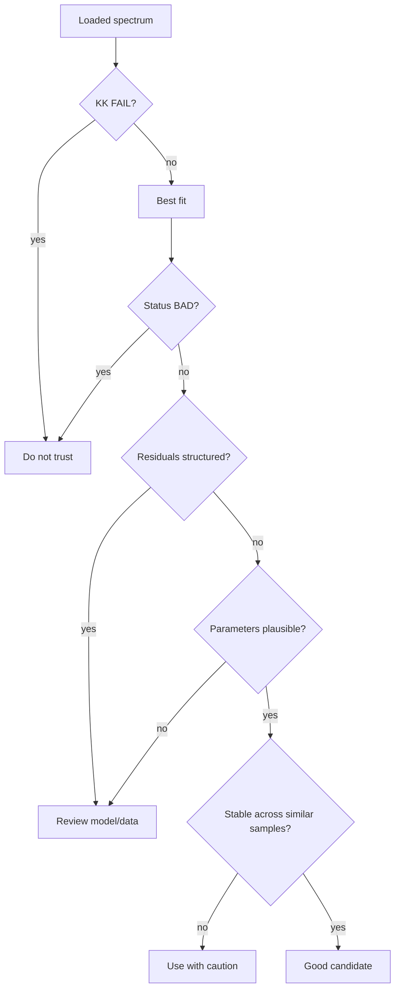

---
tags:
  - science
  - checklist
  - validation
status: active
---

# Model Validity Checklist

Используй этот чеклист перед тем, как верить fit и тащить параметры в отчёт.

## Быстрый Чеклист

- [ ] Модель имеет физический смысл для образца.
- [ ] `KK status` не `FAIL`; если `WARN`, причина понятна и записана.
- [ ] `status` не `BAD`.
- [ ] `BIC` лучше у выбранной модели, но модель не выглядит переусложнённой.
- [ ] Residuals не имеют явной структуры.
- [ ] Все параметры положительные там, где это ожидается.
- [ ] `CPE_alpha` не упёрся в нижнюю/верхнюю границу.
- [ ] Confidence intervals не огромные.
- [ ] Параметры не находятся прямо на bounds.
- [ ] Один и тот же тип образцов даёт похожий контур.
- [ ] Нет подозрительных high-frequency или low-frequency артефактов.

## Минимальный Scientific Gate

## Когда Не Верить Красивому Fit

- Сложная модель улучшила ошибку на доли процента.
- Warburg появился без видимого diffusion tail.
- Inductor появился без повторяемой inductive loop.
- Один параметр имеет uncertainty больше 200%.
- Несколько параметров сидят на bounds.
- Residuals показывают систематическую волну.
- При небольшом изменении bounds схема меняется радикально.
- `KK status = FAIL`, либо `WARN` без понятной причины на графике/частотных краях/протоколе.

## Что Сохранять В Отчёт

Минимум:

- выбранная схема;
- fit percent;
- BIC/AIC;
- status;
- flags;
- таблица параметров;
- Nyquist;
- Bode;
- residual plot.
- KK status и, если есть, `_kk_check.png`.

Именно поэтому export contract включает CSV/XLSX + plots.
