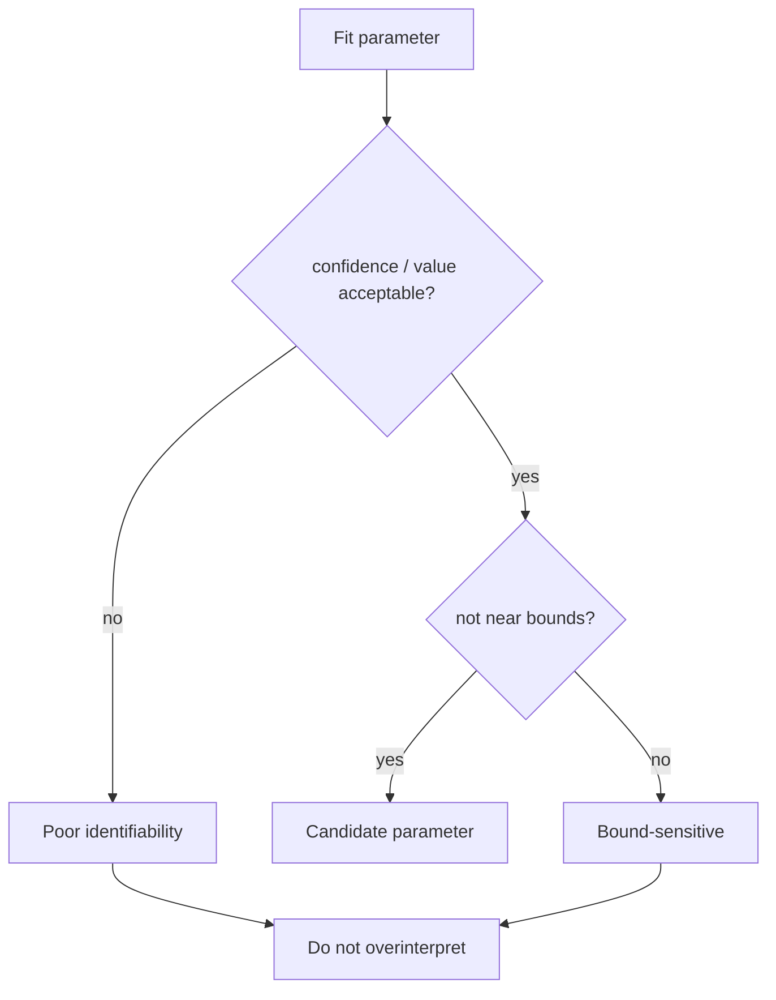

---
tags:
  - science
  - parameters
  - reference
status: active
---

# Физический смысл параметров

Короткий словарь параметров, которые появляются в текущих схемах.

## Сопротивления

| Параметр | Смысл | Подозрительно, если |
|---|---|---|
| `R0` | омическое сопротивление: раствор, сепаратор, контакты | отрицательное, слишком большое, сильно скачет по серии |
| `R1`, `R2` | сопротивления интерфейсных/плёночных/charge-transfer процессов | огромный confidence interval, near bound |

## Ёмкость И CPE

| Параметр | Смысл | Подозрительно, если |
|---|---|---|
| `C1` | идеальная ёмкость | используется для реального пористого электрода без проверки |
| `CPE0_0`, `CPE1_0` | `Q`, масштаб CPE | неидентифицируем, near bound |
| `CPE0_1`, `CPE1_1` | `alpha`, степень неидеальности | около нижней границы, физически не объясняется |

Интерпретация `alpha`:

- `alpha ~ 1`: ближе к идеальному capacitor;
- `alpha ~ 0.5`: может быть похоже на diffusion-like behavior;
- слишком низкий `alpha`: часто сигнал, что схема пытается имитировать другую физику.

## Warburg

| Элемент | Смысл |
|---|---|
| `W0` | semi-infinite Warburg |
| `Wo0` | finite-length open Warburg |
| `Ws0` | finite-length short Warburg |

Warburg-параметры надо читать только вместе с формой low-frequency участка.

## Индуктивность

| Параметр | Смысл |
|---|---|
| `L0` | индуктивный вклад |

`L0` может отражать:

- реальную inductive loop;
- adsorption/intermediate;
- wiring/fixture artifact;
- нестабильность измерения.

## Параметры И Доверие

