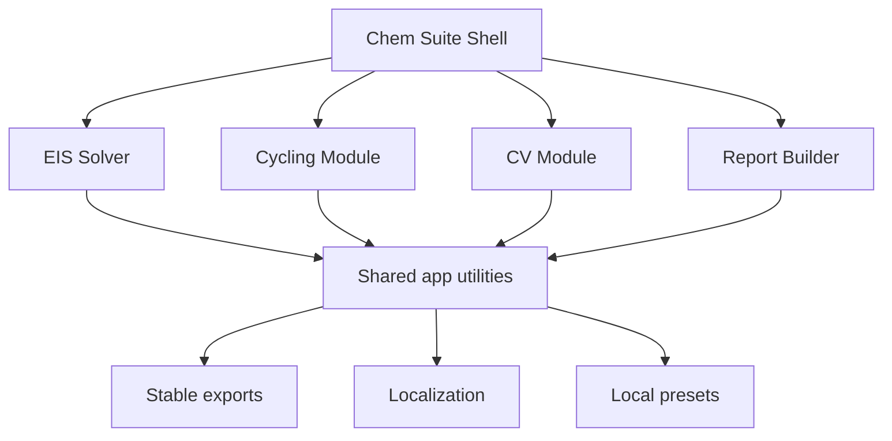

---
tags:
  - chem-suite
  - philosophy
  - architecture
status: active
---

# Chem Suite Philosophy

Эта страница фиксирует стиль будущей большой системы.

## Главный Принцип

Каждый научный модуль должен быть самостоятельной рабочей программой, но строиться так, чтобы его можно было встроить в общий Chem Suite.

EIS Solver — первый модуль и образец архитектурной культуры.

## Принципы

1. Domain logic отдельно от GUI.
2. Parser отдельно от model fitting.
3. Export contract стабилен.
4. UI language не меняет данные.
5. Advanced controls спрятаны от обычного пользователя.
6. Scientific assumptions документируются явно.
7. AI handoff обязателен.
8. Obsidian vault является частью проекта, а не декоративным приложением.

## Потенциальные Модули

| Module | Purpose |
|---|---|
| EIS Solver | impedance spectroscopy |
| Cycling | charge/discharge, capacity, CE, retention |
| CV | cyclic voltammetry, peak analysis |
| OCV | relaxation and drift |
| GITT/PITT | diffusion coefficient estimates |
| Report Builder | figures, tables, templates |

## Общая Архитектурная Идея

## Что Не Делать

- Не строить giant framework заранее.
- Не делать абстракции без второго потребителя.
- Не переносить мусор из legacy scripts.
- Не прятать физические допущения только в коде.
- Не доверять красивому fit без validity checklist.

## Что Делать

- Делать маленькие законченные production-модули.
- Фиксировать scientific playbook.
- Делать smoke tests перед каждым “релизным” состоянием.
- Поддерживать человеческую документацию.
- Держать AI-friendly handoff актуальным.

