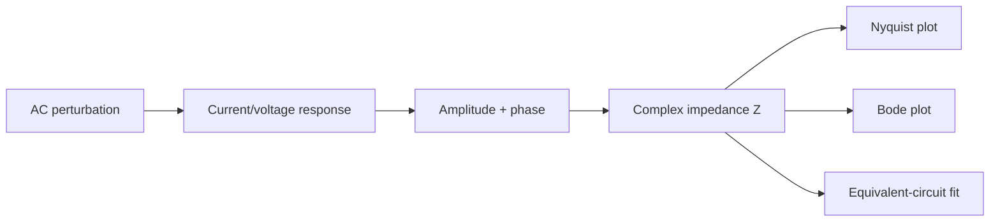

---
tags:
  - science
  - theory
  - eis
  - методичка
status: active
source: Introductory impedance spectroscopy.pdf
---

# Теория - основы импедансной спектроскопии

Эта заметка — рабочая русская выжимка для проекта, сделанная по методичке `Introductory impedance spectroscopy.pdf` и связанная с тем, как устроен EIS Solver.

> [!important] Как читать
> Это не буквальный перевод методички. Это инженерно-научный слой: какие идеи из теории важны для программы, интерпретации fit и будущего Chem Suite.

## Что Такое Импеданс

В DC-цепи сопротивление связывает ток и напряжение простым законом Ома.

В AC-цепи сигнал зависит от времени, поэтому важны:

- амплитуда;
- частота;
- фазовый сдвиг между током и напряжением;
- комплексное представление.

Импеданс:

```text
Z = Z' + jZ''
```

Где:

- `Z'` — действительная часть, связанная с резистивным откликом;
- `Z''` — мнимая часть, связанная с ёмкостным/индуктивным откликом;
- `j` — мнимая единица.

В EIS Solver это соответствует комплексному массиву:

```python
z = re + 1j * im
```

## Почему Используется Частотный Sweep

Материал или электрохимическая ячейка может иметь несколько процессов с разными характерными временами:

- bulk conduction;
- grain boundary;
- double-layer charging;
- charge transfer;
- diffusion;
- electrode polarization.

Один процесс может быть виден на высоких частотах, другой — на низких.

Поэтому EIS измеряет отклик на наборе частот.

## Базовые Элементы

| Элемент | Идеальное поведение | Интерпретация |
|---|---|---|
| `R` | не даёт фазового сдвига | омическое сопротивление |
| `C` | ток опережает напряжение | идеальная ёмкость |
| `L` | напряжение опережает ток | индуктивность / петля / артефакт |
| `CPE` | неидеальная ёмкость | распределённые time constants |
| `W` | diffusion impedance | транспортное ограничение |

## AC-Логика Для Программы



## Почему Малый Сигнал Важен

EIS обычно предполагает линейный режим:

- система около стационарного состояния;
- perturbation достаточно мала;
- отклик можно описывать линейной моделью.

Если амплитуда слишком большая, спектр может отражать уже не локальную линейную динамику, а нелинейную перестройку системы.

> [!warning] Для будущего
> В EIS Solver пока нет проверки линейности/стационарности. Это остаётся ответственностью эксперимента и пользователя.

## Связь С Нашим Fit

Эквивалентная схема — это способ выразить гипотезу о процессах через набор элементов.

Например:

```text
R0-p(R1,CPE0)
```

Означает:

- последовательное омическое сопротивление;
- параллельный интерфейсный процесс;
- неидеальную ёмкость вместо идеального конденсатора.

## Практический Вывод

> [!summary] Главная идея
> EIS — это не просто “подогнать дугу”. Это попытка разложить частотный отклик системы на процессы с разными характерными временами и физическим смыслом.

