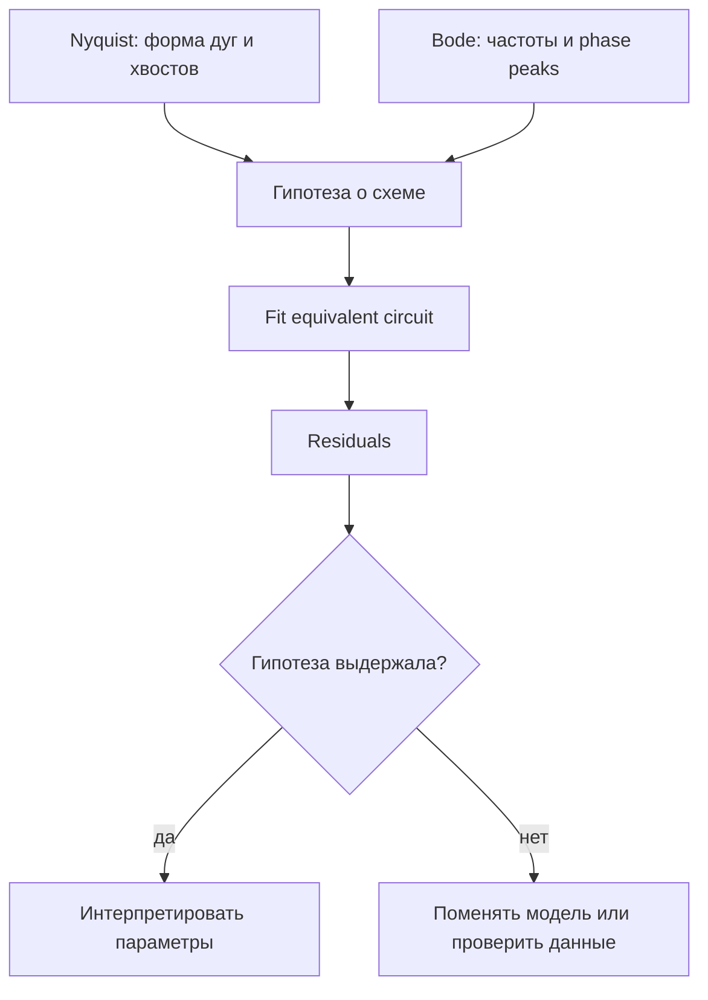

---
tags:
  - science
  - theory
  - nyquist
  - bode
  - методичка
status: active
source: Introductory impedance spectroscopy.pdf
---

# Диаграммы Найквиста и Боде: чтение спектров

Методичка подчёркивает, что один только Nyquist-график не даёт полной картины: на нём плохо видно, где находятся частоты. Поэтому Nyquist и Bode надо читать вместе.

## Диаграмма Найквиста

Обычно строится:

```text
-Im(Z) vs Re(Z)
```

Что удобно:

- видны дуги;
- видны хвосты;
- легко оценить сопротивления по пересечениям с осью Re;
- можно увидеть несколько процессов как несколько semicircles/arcs.

Что неудобно:

- частота не видна напрямую;
- разные процессы могут сливаться;
- depressed semicircle может быть неоднозначен.

## Диаграмма Боде

Bode обычно показывает:

- `|Z|` vs frequency;
- phase vs frequency.

В EIS Solver вкладка Bode строит:

```text
|Z| and phase(Z) vs frequency
```

Польза:

- видно, где по частоте находится процесс;
- phase peaks помогают считать relaxation processes;
- slope помогает отличать ёмкостное/диффузионное поведение.

## Как Читать Вместе



## Типовые Фигуры

| Форма | Nyquist | Bode | Гипотеза |
|---|---|---|---|
| один процесс | одна дуга | один phase feature | `R0-p(R1,CPE0)` |
| несколько процессов | несколько дуг | несколько phase features | несколько RC/CPE ветвей |
| blocking/polarization | низкочастотный capacitive хвост | phase уходит к ёмкостному поведению | electrode polarization |
| diffusion | наклонный low-frequency хвост | характерный slope/phase | Warburg |

## Смысл высоких и низких частот

Обычно:

- high frequency может показывать bulk/ohmic response;
- mid frequency часто отвечает интерфейсным процессам;
- low frequency может показывать electrode polarization, diffusion или медленные процессы.

Но это не универсальный закон. Реальная интерпретация зависит от ячейки, материала и экспериментальной геометрии.

## Связь С GUI

В EIS Solver после fit надо смотреть минимум:

1. Nyquist
2. Bode
3. Residuals
4. Flags
5. Best parameters

> [!tip] Рабочий принцип
> Если Nyquist выглядит красиво, но Bode phase и residuals не согласуются с моделью, доверять fit нельзя.
