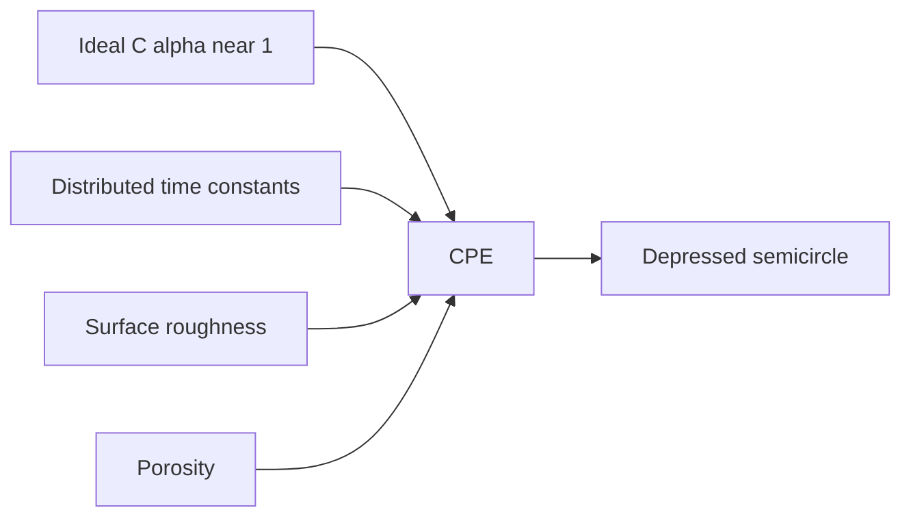

---
tags:
  - science
  - theory
  - cpe
  - warburg
  - методичка
status: active
source: Introductory impedance spectroscopy.pdf
---

# Реальные системы - CPE, Warburg и неоднозначность схем

Идеальные схемы дают красивые semicircles. Реальные электрохимические и ионные системы часто дают depressed semicircles, tilted spikes, diffusion tails и перекрывающиеся процессы.

## Почему Идеальный RC Часто Не Работает

Идеальный `R||C` предполагает один чистый time constant.

Реальный материал может иметь:

- шероховатые электроды;
- неоднородную поверхность;
- распределение размеров пор;
- grain / grain boundary contributions;
- неодинаковые локальные токи;
- electrode/electrolyte interface effects.

Итог: дуга “сплющивается”, центр semicircle уходит ниже оси.

## Constant Phase Element

CPE используется как компактный способ описать неидеальную ёмкость.

В наших circuit strings:

```text
CPE0
CPE1
```

В параметрах:

```text
CPE0_0 = Q
CPE0_1 = alpha
```

Интерпретация:

- `Q` задаёт масштаб;
- `alpha` задаёт степень отклонения от идеального capacitor.



## Warburg И Diffusion

Warburg появляется, когда transport/diffusion ограничивает реакцию.

Типичные элементы:

- `W` / `W0` — semi-infinite diffusion;
- `Wo` — finite-length open;
- `Ws` — finite-length short.

В программе это относится к `Transport` / `Diffusion` family.

> [!danger] Важное ограничение
> Warburg улучшает fit не всегда потому, что в системе есть настоящая диффузия. Иногда он просто поглощает low-frequency ошибки или артефакты.

## Неоднозначность Equivalent Circuit

Методичка явно ведёт к важной мысли: разные схемы могут давать похожие impedance spectra.

Это критично для EIS Solver:

- fit не доказывает уникальную схему;
- BIC помогает, но не решает физику;
- residuals помогают, но не заменяют понимание ячейки;
- нужна проверка серии образцов и экспериментального контекста.

## Для Нашего Алгоритма

Текущий pipeline хорошо согласуется с этим:

1. Auto-fit даёт screening.
2. BIC штрафует сложность.
3. Flags ловят плохую идентифицируемость.
4. Pro mode позволяет задать физически ожидаемую схему.
5. Manual bounds позволяют не отдавать всё “магии” optimizer.

## Практическое Правило

> [!summary] Модель выбирают не только по ошибке
> Приоритет: физическая гипотеза → качество residuals → идентифицируемость параметров → BIC/ошибка.

