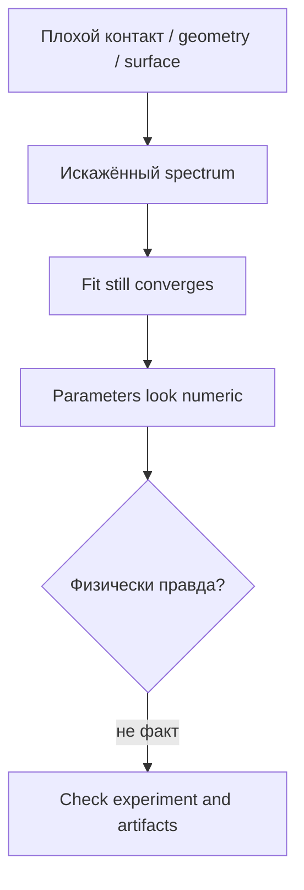

---
tags:
  - science
  - experiment
  - artifacts
  - методичка
status: active
source: Introductory impedance spectroscopy.pdf
---

# Экспериментальная практика и артефакты

Методичка уделяет внимание экспериментальным деталям: sample cell, electrodes, holders, roughness, connection to analyzer. Для программы это важно, потому что плохой эксперимент может породить красивый, но ложный fit.

## Почему Экспериментальная Геометрия Важна

Impedance spectrum зависит не только от материала, но и от:

- формы образца;
- площади контакта;
- качества поверхности;
- типа электродов;
- sample holder;
- проводов и подключения к analyzer;
- температуры и атмосферы;
- стабильности системы.

## Surface Roughness

Шероховатость может менять effective area и double-layer response.

В спектре это может проявляться как:

- increased capacitance;
- depressed semicircle;
- CPE-like behavior;
- плохая повторяемость.

## Blocking И Non-Blocking Electrodes

Blocking electrodes:

- не дают свободного charge transfer через interface;
- могут вызывать electrode polarization;
- часто дают низкочастотный capacitive contribution.

Non-blocking electrodes:

- допускают charge transfer;
- могут включать Faradaic reactions;
- дают другую low-frequency структуру.

## Что Должен Помнить Пользователь EIS Solver

## Артефакты, Которые Похожи На Физику

| Артефакт | Может выглядеть как |
|---|---|
| wiring/fixture inductance | inductive loop |
| poor contact | extra resistance / distorted high frequency |
| rough surface | CPE/depressed arc |
| unstable sample | noisy low-frequency tail |
| electrode polarization | capacitive low-frequency spike |

## Практический Experimental Checklist

- [ ] Проверить contact quality.
- [ ] Проверить geometry и площадь.
- [ ] Проверить диапазон частот.
- [ ] Проверить amplitude perturbation.
- [ ] Проверить повторяемость.
- [ ] Проверить, нет ли low-frequency drift.
- [ ] Проверить blank/reference, если возможно.
- [ ] Не интерпретировать `L` и `W` без экспериментального контекста.

## Связь С Программой

EIS Solver может показать:

- residuals;
- flags;
- parameter confidence;
- model ambiguity.

Но он не может знать:

- была ли поверхность подготовлена правильно;
- был ли контакт стабильным;
- не дрейфовала ли система во времени;
- подходит ли frequency range.

> [!important] Вывод
> Scientific validity начинается до загрузки файла в программу.

