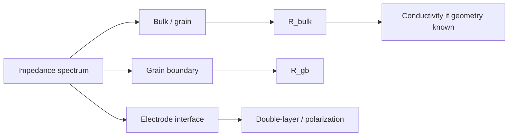

---
tags:
  - science
  - transport
  - eis
  - методичка
status: active
source: Introductory impedance spectroscopy.pdf
---

# Transport Properties From EIS

Методичка связывает impedance plots с transport properties: bulk resistance, conductivity, ionic mobility, concentration of mobile ions и diffusion-related quantities.

В текущем EIS Solver это пока не автоматизировано, но важно как дорожная карта.

## Что Уже Есть

Программа уже оценивает:

- `R0`;
- transfer-like resistances;
- CPE/Warburg parameters;
- best circuit;
- confidence;
- BIC/AIC;
- residuals.

## Что Можно Добавить Потом

При наличии geometry metadata:

- sample thickness;
- electrode area;
- temperature;
- material density/composition;
- cell constant;

можно считать:

```text
conductivity = thickness / (R_bulk * area)
```

или эквивалентные transport metrics.

## Bulk И Grain Boundary

Для polycrystalline/solid electrolyte systems часто различают:

- bulk/grain contribution;
- grain boundary contribution;
- electrode/interface contribution.

В Nyquist это может выглядеть как несколько дуг с разными capacitance/time constants.



## Почему Нужна Geometry В Программе

Без геометрии fit даёт circuit parameters, но не полноценные material transport properties.

Для будущего Chem Suite можно добавить:

- sample metadata panel;
- area/thickness fields;
- units;
- conductivity export;
- temperature-normalized comparisons;
- batch statistics by sample group.

## Осторожность

Transport properties нельзя автоматически считать из “лучшей схемы”, если:

- дуги не разделены;
- parameters плохо идентифицируются;
- схема неоднозначна;
- нет geometry;
- электродный вклад смешан с bulk/grain contribution.

## Возможный Future Feature

`Transport Analysis` tab:

1. Пользователь выбирает, какой resistance считать bulk/grain/interface.
2. Вводит geometry.
3. Программа считает conductivity/mobility-related metrics.
4. Экспортирует в XLSX вместе с fit diagnostics.

Это должно быть Pro/advanced feature, не default auto magic.

