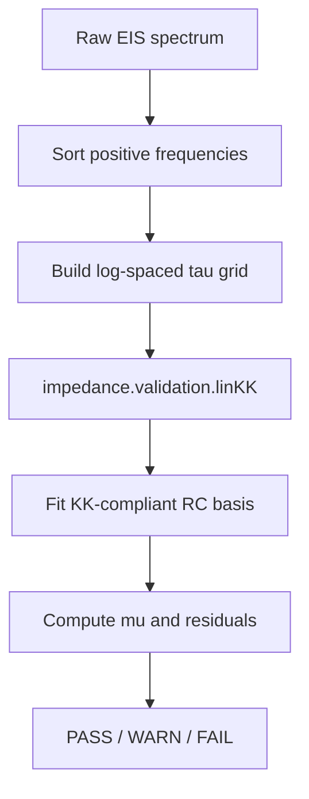
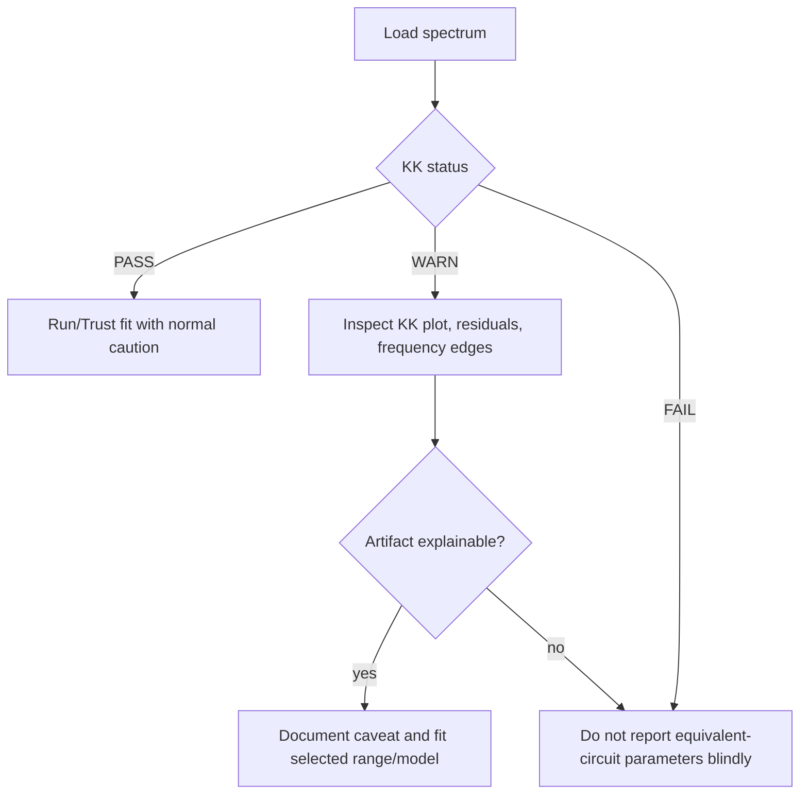

---
tags:
  - science
  - validation
  - kramers-kronig
status: active
---

# Проверка Крамерса—Кронига

Эта страница фиксирует научный gate в EIS Solver: быструю проверку спектра на Kramers-Kronig consistency через библиотечный метод `impedance.validation.linKK`.

## Зачем Это Нужно

Equivalent-circuit fit может красиво лечь на данные, даже если сами данные получены не в условиях линейности, стабильности и причинности. Kramers-Kronig-проверка нужна до доверия к параметрам схемы.

Проще:

- fit отвечает: “какая схема хорошо описывает этот набор точек?”;
- KK-check отвечает: “похож ли сам набор точек на физически допустимый EIS-спектр?”.

## Что Реализовано В Коде

Внешняя функция-обёртка живёт в `eis_core.py`:

```python
lin_kk_check(frequencies, z_data)
```

Внутри используется:

```python
impedance.validation.linKK(...)
```

Она возвращает `KramersKronigResult`:

| Поле | Смысл |
|---|---|
| `status` | `PASS`, `WARN` или `FAIL` |
| `rmse_percent` | RMS относительной ошибки Lin-KK реконструкции |
| `max_error_percent` | максимальная относительная ошибка |
| `mu` | Schönleber under/over-fitting criterion из `impedance.py` |
| `n_rc` | число RC-звеньев в базисе |
| `flags` | машинные причины предупреждения/ошибки |
| `z_fit` | восстановленный спектр |
| `relative_error_percent` | ошибка по каждой частоте |

## Как Работает Алгоритм

Библиотечная реализация строит логарифмическое распределение времён релаксации:

```text
tau_min ~= 1 / (2*pi*f_max)
tau_max ~= 1 / (2*pi*f_min)
```

Затем спектр аппроксимируется линейной суммой:

```text
Z_fit = R_inf + sum_k R_k / (1 + j*omega*tau_k)
```

Коэффициенты находятся линейной регрессией. Число RC-звеньев подбирается итеративно по критерию `mu`, чтобы не уходить в under/over-fitting.



## Пороговая Логика

Текущие практические пороги в нашей обёртке:

| Условие | Статус |
|---|---|
| `rmse_percent <= 2`, `max_error_percent <= 10`, `mu` достиг cutoff `0.85` | `PASS` |
| превышен мягкий порог, но не жёсткий | `WARN` |
| `rmse_percent > 5` или `max_error_percent > 20` | `FAIL` |

Важно: `WARN` не значит “данные плохие”. Это значит “посмотри глазами на KK Check, residuals, частотные края и протокол эксперимента”.

## Что означает `mu`

`mu` — критерий из Lin-KK метода Schönleber et al., который помогает выбрать число RC-звеньев и не переобучить спектр. Если алгоритм не может достичь cutoff `mu <= 0.85` до `max_M`, это повод смотреть данные осторожнее.

Проблемы с `mu` могут указывать на:

- шум;
- артефакты на высоких или низких частотах;
- дрейф системы во времени;
- нестационарность;
- не-EIS-поведение;
- слишком простой или слишком гибкий RC-базис.

Это не самостоятельный приговор, но хороший красный флажок.

## Где Это Видно В Программе

- В таблице datasets появилась колонка `KK`.
- Во вкладке `KK Check` показывается:
  - статус;
  - RMSE;
  - max error;
  - `mu`;
  - Nyquist experiment vs Lin-KK reconstruction;
  - ошибка по частоте.
- В CLI появился блок `=== Kramers-Kronig check ===`.
- В export добавлены:
  - поля `kk_*` в `_summary.csv`;
  - отдельный `_kk_check.csv`;
  - лист `KK Check` в `_workbook.xlsx`;
  - `_kk_check.png` в selected report plots.

## Как Использовать В Научном Решении



## Чего Это Пока Не Делает

- Это не полный интегральный Kramers-Kronig transform.
- Это не замена повторным измерениям.
- Это не доказывает уникальность эквивалентной схемы.
- Это не проверяет автоматически амплитуду AC-сигнала, OCV drift, термостабильность или качество контактов.

## Источник Метода

В коде используется реализация `impedance.py`, основанная на:

Schönleber, M. et al. “A Method for Improving the Robustness of linear Kramers-Kronig Validity Tests.” Electrochimica Acta 131, 20-27 (2014). DOI: `10.1016/j.electacta.2014.01.034`.

## Принятое инженерное решение

В EIS Solver KK-check считается gate качества данных, а не частью выбора лучшей схемы.

Best circuit по-прежнему выбирается через fit diagnostics и BIC среди non-BAD моделей. KK-status должен попадать в отчёт рядом с fit status, потому что хороший fit на плохом спектре не является хорошим научным результатом.
