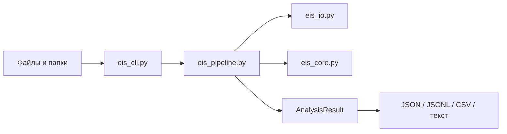

---
tags:
  - architecture
  - cli
  - validation
status: active
---

# Пакетный конвейер и CLI

Консольный интерфейс предназначен не только для ручной проверки одного файла. Он служит машинным входом для массового прогона открытых и лабораторных наборов данных без запуска Qt.

## Устройство



`eis_pipeline.py` отвечает за полный анализ одного файла: загрузку, оценку масштаба, Lin-KK, фитинг выбранных схем, выбор лучшего результата, измерение времени и фиксацию ошибки. Он не импортирует Qt и пригоден для будущих интерфейсов.

## Быстрые команды

Один файл с человеческим выводом:

```powershell
.\.venv\Scripts\python.exe eis_cli.py sample.csv
```

Рекурсивный прогон папки с потоковым JSONL:

```powershell
.\.venv\Scripts\python.exe eis_cli.py datasets --recursive --format jsonl --output artifacts\run-001
```

Только проверка парсера:

```powershell
.\.venv\Scripts\python.exe eis_cli.py datasets --recursive --mode parse --format csv --output artifacts\parse-check
```

Только Lin-KK:

```powershell
.\.venv\Scripts\python.exe eis_cli.py datasets --recursive --mode kk --format jsonl --output artifacts\kk-check
```

Одна заданная схема:

```powershell
.\.venv\Scripts\python.exe eis_cli.py sample.csv --circuit "R0-p(R1,CPE0)" --format json
```

## Наборы схем

Параметр `--preset` принимает:

| Значение | Содержание |
|---|---|
| `auto` | Полный стандартный список |
| `simple` | Простые RC/CPE-схемы |
| `interface` | Межфазные процессы и перенос заряда |
| `diffusion` | Схемы с элементами Варбурга |
| `inductive` | Схемы с индуктивностью |

`--circuit` можно повторить несколько раз. `--circuits-file` читает по одной схеме из каждой непустой строки; строки с `#` считаются комментариями.

## Несколько стартов оптимизатора

Для сложных схем можно повторить fit из нескольких детерминированных начальных приближений:

```powershell
.\.venv\Scripts\python.exe eis_cli.py sample.csv --preset simple --restarts 4 --restart-seed 20260719
```

Каждый старт получает полный бюджет `--max-evaluations`. В результат записываются количество попыток, число успешных стартов и индекс лучшего. По умолчанию используется один старт: multi-start улучшает поиск локального минимума, но увеличивает время и сам по себе не решает неидентифицируемость модели.

## Форматы результата

- `text` предназначен для человека;
- `json` удобен для одного файла;
- `jsonl` хранит один независимый JSON-объект на строку и предназначен для больших прогонов;
- `csv` содержит компактную сводку по файлам.

Каждый JSON-результат содержит `schema_version`. Числа `NaN` и бесконечности заменяются на `null`, поэтому выход совместим со строгими JSON-парсерами.

В результате сохраняются:

- путь и формат файла;
- выбранный канал и метаданные парсера;
- количество точек и оценка масштаба;
- результат Lin-KK;
- все попытки фитинга;
- лучшая схема и её параметры с неопределённостями;
- диагностические флаги;
- стадия и текст ошибки;
- время обработки.

Ключ `--summary-only` исключает подробности всех конкурирующих моделей и уменьшает размер файла.

## Устойчивость массового прогона

По умолчанию ошибка одного входного файла не останавливает серию. Для остановки на первой ошибке используется `--fail-fast`.

При записи JSONL результат дописывается сразу после завершения очередного файла. Если процесс прерван, уже записанные строки остаются пригодными для анализа. Повторный запуск сейчас начинает новый файл результатов; автоматическое продолжение с последней строки — отдельная будущая возможность.

## Коды завершения

| Код | Значение |
|---:|---|
| `0` | Все обработанные входы завершились успешно |
| `1` | Внутренняя ошибка или ошибка записи результата |
| `2` | Некорректные аргументы командной строки |
| `3` | Ошибка входного пути, чтения или проверки данных |
| `4` | Анализ дошёл до фитинга, но не получил результата |

Код процесса описывает весь запуск. Подробная причина каждого отдельного сбоя всегда записывается в `stage` и `error_message`.

## Граница текущей версии

Конвейер уже готов к сотням последовательных файлов. Параллельная обработка намеренно не включена: сначала нужно измерить потребление памяти, устойчивость SciPy и выигрыш на реальных корпусах. Возобновление прогона, manifest эксперимента и сравнение двух запусков относятся к следующему слою испытательной инфраструктуры.
