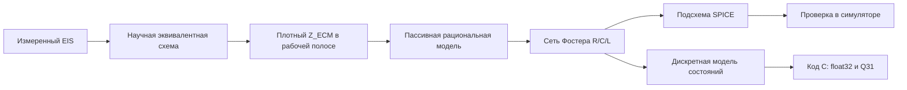

---
tags:
  - архитектура
  - spice
  - инженерная-модель
status: active
---

# SPICE и инженерные макромодели

## Решение

SPICE-ветка не заменяет электрохимический подбор модели и не выполняет вторую
независимую аппроксимацию экспериментальных данных. Основной поток:



У пользователя должны оставаться два разных артефакта:

1. **Научная эквивалентная схема** — топология, найденные параметры,
   диагностика, статистические и физические ограничения.
2. **Инженерная макромодель** — коэффициенты рациональной функции, полюса,
   рабочая частотная полоса, ошибка аппроксимации, признаки пассивности и
   устойчивости, а также выбранный способ экспорта.

Электротехническая модель отвечает на вопрос «как воспроизвести найденную
частотную характеристику в симуляторе», но не получает право переименовывать
свои R/C-ветви в химические процессы.

## Рациональное внутреннее представление v1

Первый внутренний формат:

$$
Z(s)=d+s e+\sum_{k=1}^{N}\frac{r_k}{s+a_k},
$$

где:

- $a_k>0$ — скорости релаксации, поэтому полюса $p_k=-a_k<0$;
- $d\ge 0$ — последовательный резистор;
- $e\ge 0$ — последовательная индуктивность;
- $r_k\ge 0$ — вычеты.

Фиксированные $a_k$ располагаются логарифмически вокруг рабочей полосы.
Остальные коэффициенты находятся взвешенным методом наименьших квадратов,
который одновременно учитывает действительную и мнимую части импеданса и
запрещает отрицательные коэффициенты. Это **детерминированная пассивная
аппроксимация сетью Фостера**, а не полноценный алгоритм Vector Fitting:
комплексные полюса, итеративное перемещение полюсов и общий контроль
положительно-вещественности пока не реализованы.

Ограничение $d,e,r_k\ge0$ и отрицательные вещественные полюса дают устойчивую
пассивную сеть по построению. Такая модель уже подходит как общее внутреннее
представление для нескольких способов экспорта.

## Преобразование в сеть Фостера R/C/L

Каждое релаксационное слагаемое точно реализуется параллельной R-C ветвью:

$$
\frac{r_k}{s+a_k}
=\frac{R_k}{1+sR_kC_k},
\qquad
R_k=\frac{r_k}{a_k},
\qquad
C_k=\frac{1}{r_k}.
$$

Все ветви, $d$ и $e$ соединяются последовательно. Экспортёр использует только
обычные `R`, `C`, `L`, `.subckt/.ends` и поэтому не зависит от
особого синтаксиса оператора Лапласа в конкретном симуляторе.

Численно положительные субнормальные вычеты, которые требуют бесконечной
ёмкости или нулевого сопротивления, не экспортируются. Для SPICE v1 конечная
ветвь также исключается, если её максимальный импеданс меньше `0,2%` от
минимального `|Z|` в объявленной полосе. Это предварительная настройка
численной обусловленности с учётом рабочей полосы. Её влияние измеряется
отдельной ошибкой «рациональная модель → сеть Фостера» и должно быть
перепроверено на замороженном корпусе.

## Реализованный код

- `eis_rational.py` — `PassiveRationalModel`, метрики, подбор с
  ограничениями, секции Фостера, представление для JSON и безопасный переход
  от `FitResult`.
- `eis_spice.py` — аналитическая проверка компонентной сети, переносимая
  `.subckt`, проверочная схема ngspice, разбор результатов и автоматическая
  сквозная проверка во внешнем симуляторе.
- `eis_spice_benchmark.py` — воспроизводимый массовый стенд, выбор
  минимального допустимого порядка и закрытые ворота при любом нарушении
  критериев.
- `tests/test_rational.py` — формула, устойчивость, пассивность, аппроксимация
  CPE, машинные хвосты и ограничения входных данных.
- `tests/test_spice.py` — точность преобразования в сеть Фостера, структура
  списка соединений, проверочная схема и статус `runtime_missing`.
- `tests/test_spice_benchmark.py` — замороженный манифест, выбор порядка,
  разделение частей корпуса и учёт отказов.

`scipy` теперь прямая зависимость, поскольку инженерная аппроксимация напрямую
использует `scipy.optimize.lsq_linear`.

## Ворота выдачи модели

SPICE-модель можно помечать статусом `validated` («проверена») только при
выполнении отдельных условий:

1. исходная научная эквивалентная схема допустима по своему договору;
2. рациональная модель устойчива и пассивна;
3. ошибка рациональной модели относительно `Z_ECM` посчитана в объявленной
   полосе;
4. ошибка сети Фостера относительно рациональной модели ниже отдельного
   порога;
5. выполнена внешняя проверка в поддерживаемой версии SPICE-симулятора;
6. в файле результата записаны симулятор, версия, полоса, порядок и метрики.

Пункты 3–5 — три разные ошибки. Нельзя выдавать аналитическую проверку
компонентной сети за фактический запуск SPICE.

Начальные инженерные критерии допуска для следующего замороженного пилота:

- средняя относительная ошибка к ECM `<= 1%`;
- максимальная относительная ошибка к ECM `<= 10%`;
- максимальная ошибка «рациональная модель → сеть Фостера» `<= 0,25%`;
- максимальная ошибка «сеть Фостера → ngspice» `<= 1e-6%`;
- внешняя проверка в ngspice обязательна перед пользовательским экспортом.

Это стартовые инженерные пороги, не научно откалиброванные доверительные
границы.

Функция перехода `fit_from_ecm_result()` принимает только успешные результаты
со статусом `OK` или `WARN`, в которых есть вычисляемая ECM. Статусы `BAD` и
`FAIL`, отсутствие модели или неудачный подбор останавливают экспорт до
построения рациональной аппроксимации.

## Первый синтетический пилот

Полоса `0,01–100000 Гц`, 180 точек ECM, порядок 32. Внешний расчёт переменного
тока выполнен в ngspice 46 с плотностью 40 точек на декаду, всего 281 точка:

| ECM | средняя ошибка к ECM | наибольшая ошибка к ECM | модель → Фостер | Фостер → ngspice | число RC-секций |
|---|---:|---:|---:|---:|---:|
| `R0-p(R1,C1)` | `0,9174%` | `3,0834%` | `4,31e-14%` | `3,96e-13%` | 2 |
| `R0-p(R1,CPE0)` | `0,00178%` | `0,00694%` | `0,09571%` | `3,11e-7%` | 24 |
| `R0-p(R1,CPE0)-W0` | `0,00215%` | `0,00969%` | `0,16446%` | `1,23e-8%` | 28 |
| `L0-R0-p(R1,CPE0)-Wo0` | `0,6553%` | `9,9071%` | `0,000562%` | `4,66e-11%` | 18 |

Все четыре модели устойчивы и пассивны. Они прошли начальные критерии
аппроксимации, компонентного представления и внешнего симулятора. Это быстрая
проверка на контролируемых спектрах, а не корпусная валидация.

Полный отчёт:
`validation_data/reports/2026-07-19-spice-foster-pilot.md`.

Первая сгенерированная подсхема и запущенная проверочная схема сохранены в
`validation_data/artifacts/spice_foster_pilot/`.

Использована официальная переносимая сборка ngspice 46 для Windows. Архив:
`ngspice-46_64.7z`, SHA-256
`7ED713CD8D401DB724FFE99087C3122BF05A9CFA99DE02C6EEED44EE44785A33`.
Исполняемая среда распакована вне Git в `D:\eis2\.runtime\ngspice-46`; путь
передаётся явно, глобальная переменная `PATH` не изменена.

## Замороженный инженерный корпус v1

Корпус зафиксирован до запуска в
`validation_data/manifests/spice_engineering_corpus_v1.json`:

- 6 настроечных синтетических сценариев;
- 6 новых синтетических контрольных сценариев;
- 6 контрольных ECM, ранее подобранных по реальным измерениям LiPo;
- порядки `8`, `12`, `16`, `24`, `32`;
- выбор наименьшего порядка, прошедшего все ворота;
- неизменённый порог отсечения секций `0,002`.

После просмотра настроечной части критерии не менялись. Итог:

| часть корпуса | прошло |
|---|---:|
| настроечная синтетика | 5/6 |
| контрольная синтетика | 5/6 |
| контрольные реальные ECM | 6/6 |
| всего | 16/18 |

Среди 16 допущенных моделей порядок 12 выбран восемь раз, порядок 16 — шесть,
порядок 24 — два; порядок 32 не понадобился ни разу. Наибольшая ошибка
допущенной модели к ECM составила `0,9624%` в среднем и `9,9062%` в отдельной
точке. Наибольшая внешняя ошибка ngspice составила `4,641e-7%`.

Оба отказа пришлись на синтетические схемы с двумя CPE. При увеличении порядка
их совпадение с ECM улучшалось, но численное совпадение длинной сети с
ngspice ухудшалось. Например, в контрольном случае порядок 32 дал всего
`0,00901%` средней ошибки к ECM, но `0,006131%` внешней ошибки при
замороженном пороге `1e-6%`. Поэтому рост порядка нельзя считать безусловным
улучшением инженерной модели.

Полный отчёт:
`validation_data/reports/2026-07-19-spice-engineering-corpus-v1.md`.

Машинные результаты находятся в исключённом из Git каталоге
`validation_data/artifacts/spice_engineering_corpus_v1/`.

## Обработка плохо обусловленных номиналов

Первый корпус выявил ошибку прежнего правила отсечения: оно оценивало
сопротивление RC-секции на постоянном токе, а не её фактический вклад внутри
объявленной полосы. Поэтому внеполосные полюса могли оставлять огромные
ёмкости, почти не влиявшие на рабочий импеданс, но ухудшавшие матрицу ngspice.

Новая стратегия `global_error_budget` использует глобальный бюджет ошибки:

1. на плотной сетке измеряется вклад каждой секции в рабочей полосе;
2. самые слабые секции последовательно пробуются на удаление;
3. удаление принимается только при ошибке всей оставшейся сети не выше
   `0,25%`;
4. один и тот же выбранный набор секций используется в аналитической и
   внешней проверке.

Новый корпус
`validation_data/manifests/spice_conditioning_corpus_v2.json` содержит 6
настроечных и 16 контрольных случаев, включая 6 других реальных LiPo ECM.
После настроечной части ничего не перенастраивалось:

| часть корпуса | прошло |
|---|---:|
| настроечная синтетика | 6/6 |
| контрольная синтетика | 8/10 |
| контрольные реальные ECM | 6/6 |
| всего | 20/22 |

В выбранных моделях удалено 107 из 340 секций (`31,5%`). Максимальная ошибка
компонентной реализации составила `0,2464%`, внешняя ошибка —
`3,677e-7%`. Из 61 порядка, дошедшего до ngspice, три были отклонены внешними
воротами, но для каждого сценария нашёлся другой допустимый порядок.

Поэтому внешний порог `1e-6%` сохраняется без ослабления, а фактический запуск
ngspice остаётся обязательным. Два отказа корпуса связаны не со SPICE, а с
ошибкой рациональной аппроксимации крайних идеальных RC на масштабах
`10⁻⁴ Ω` и `10⁵–10⁶ Ω`.

Полный отчёт:
`validation_data/reports/2026-07-19-spice-conditioning-corpus-v2.md`.

## Пользовательский экспорт из командной строки

Реализован однофайловый экспорт проверенного пакета:

```powershell
.\.venv\Scripts\python.exe eis_cli.py "spectrum.csv" `
  --spice-export "result\cell_spice" `
  --ngspice "C:\path\to\ngspice_con.exe"
```

После успеха появляется один каталог:

```text
cell_spice/
  model.lib
  passport.json
```

`model.lib` содержит переносимую подсхему `EIS_MODEL` из обычных R/C/L.
`passport.json` содержит:

- контрольную сумму и путь исходного спектра;
- выбранный канал и число точек;
- научную схему, параметры, BIC, статус и флаги;
- результат проверки Крамерса — Кронига;
- все инженерные пороги и проверенные порядки;
- полюса, вычеты, рабочую полосу и выбранные секции;
- ошибки к ECM и компонентной реализации;
- число исходных, удалённых и экспортированных секций;
- путь, версию, число точек и ошибку ngspice;
- контрольную сумму `model.lib`.

Пакет публикуется атомарно: при любом отказе конечный каталог не создаётся.
Существующий каталог никогда не перезаписывается. Отсутствие ngspice не
заменяется аналитической проверкой.

Первый настоящий экспорт выбранной двухдуговой ECM прошёл на порядке 16:
средняя ошибка к ECM `0,01897%`, ошибка реализации `0,05893%`, внешняя ошибка
ngspice 46 `2,282e-7%`; экспортировано 14 из 16 секций.

Отчёт:
`validation_data/reports/2026-07-19-spice-user-export-smoke.md`.

В графическом интерфейсе тот же экспорт доступен как действие
`Пакет SPICE...` в конце основной панели инструментов. Оно полностью скрыто
вне Pro mode, не дублируется в главном меню и становится доступным только
после подбора модели выбранного спектра. Разделитель перед действием также
скрывается, поэтому в обычном режиме панель визуально не меняется.

## Следующие этапы

1. Проверить выбор внешнего ngspice и создание пакета в собранной программе
   на чистой машине.
2. Исправить масштабирование рациональной аппроксимации для крайних
   сопротивлений как расширение диапазона применимости, не блокирующее
   обычный экспорт.
3. Провести целевую проверку кода C на STM32F103 и замороженный корпус
   периодов, полос и масштабов. Текущий договор описан в
   [[35 Экспорт C для контроллеров]].

## Что пока не заявляем

- что SPICE подтверждает истинность электрохимической топологии;
- что первый порядок 32 оптимален;
- что модель валидна за пределами объявленной полосы;
- что аналитическое преобразование в сеть Фостера заменяет внешнюю проверку
  в симуляторе;
- что успешная сборка C на хосте уже доказывает соблюдение времени и памяти
  на конкретном контроллере;
- что произвольный активный или непассивный EIS можно представить этой
  пассивной рациональной моделью.
